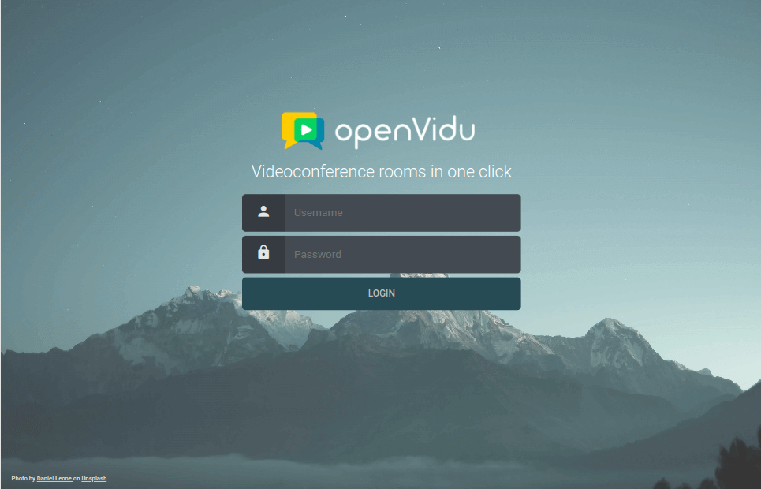
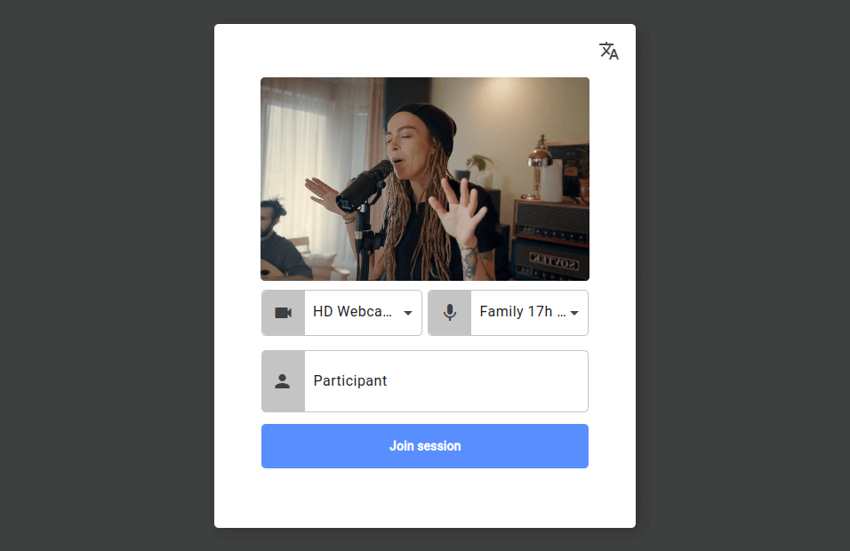

<h1 class="logo-header meet-header">

</h1>

<h2 class="meetplatform-slogan">
Host and customize your own high-quality video calling service in minutes
</h2>

-   :material-server:{ .more-padding-icon .ov-meet-commercial-icon } __Host on your servers__{ .feature-name }

    ---

    OpenVidu Meet is designed from the ground up to be [**self-hosted**](docs/self-hosting/production-ready/index.md){.no-break} on your own servers. AWS and Azure templates are also available.

-   :material-timer-sand:{ .padding-icon .ov-meet-commercial-icon } __Easy to deploy__{ .feature-name }

    ---

    OpenVidu Meet is easy to deploy, protect, mantain and scale. No advanced DevOps skills are required to run it in production.

-   :material-security:{ .more-padding-icon .ov-meet-commercial-icon } __Private and secure__{ .feature-name }

    ---

    With OpenVidu Meet you can comply with the highest safety standards. No data flows through third-party servers.

-   :material-format-paint:{ .padding-icon .ov-meet-commercial-icon } __Quick integration and customization__{ .feature-name }

    ---

    OpenVidu Meet can be used out-of-the-box and customized view web. Or embed OpenVidu Meet in your existing web or mobile app using the [**REST API**]().

<h2 class="meetplatform-slogan wow animated animatedFadeInUp fadeInUp" style="margin: 5em 0">
Built for all purposes.

Customizable for your particular use case.
</h2>

-	:material-lock:{ .ov-call-commercial-icon .middle } __Secure room access__{ .ov-call-commercial-card-title }

    OpenVidu Call offers a straightforward **authentication system** enabling users to join rooms with a single click.

    Additionally, it automatically generates **unique room names**, providing a distinct URL for each room. This allows users to easily share the URL with friends and colleagues to join the room.

{.round-corners}

---

<!-- feature card -->

{.round-corners}

-	:fontawesome-solid-gear:{ .ov-call-commercial-icon .middle } __Setting up your room__{ .ov-call-commercial-card-title }

    OpenVidu Call provides users with various options and **configurations** to personalize their experience **before and after entering a room**.

    This includes testing and **selecting audio and video devices**, choosing a nickname, and **adjusting the preferred language**.

---

<h2 class="meetplatform-slogan">
With all the features you need to build your perfect video calling service
</h2>

-   :material-cursor-default-click:{ .feature-icon .padding-icon } __One-click video calls__{ .feature-name }

    ---

    Share links to allow users to join video calls. Compatible with any web browser. No installations required.

-   :material-registered-trademark:{ .feature-icon .padding-icon } __Your own branding__{ .feature-name }

    ---

    Deliver a professional experience by customizing OpenVidu Meet with your own domain, branding colors and logo.

-   :material-video-4k-box:{ .feature-icon .padding-icon } __Up to 4K video and HiFi audio__{ .feature-name }

    ---

    Up to 4K video resolution, and crisp audio quality with noise cancellation and echo suppression.

-   :material-record-rec:{ .feature-icon } __Recording__{ .feature-name }

    ---

    Record your video calls with different layouts. Manage recording permissions and access with ease.

-   :octicons-broadcast-24:{ .feature-icon .padding-icon } __Broadcasting__{ .feature-name }

    ---

    OpenVidu Meet allows you to broadcast your video calls to platforms such as YouTube or Twitch.

-   :material-face-man-shimmer-outline:{ .feature-icon .padding-icon } __Background effects__{ .feature-name }

    ---

    Apply effects to your videos, blurring the background or replacing it with an image.

-   :material-monitor-share:{ .feature-icon .padding-icon } __Screen Sharing__{ .feature-name }

    ---

    Screen sharing with the best quality.

-   :material-chat-outline:{ .feature-icon .padding-icon } __Advanced chat__{ .feature-name }

    ---

    OpenVidu Meet integrates an advanced chat with support of rich messages, emojis, reactions and more.

-   :material-subtitles-outline:{ .feature-icon .padding-icon } __Live Captions__{ .feature-name }

    ---

    Support for a vast number of speech-to-text providers.

-   :material-wifi-lock:{ .feature-icon .padding-icon } __E2E Encryption__{ .feature-name }

    ---

    Avoid man-in-th-middle attacks: only your final users can decrypt the audio, video and chat messages.

-   :material-door-sliding-lock:{ .feature-icon .padding-icon } __Locked rooms__{ .feature-name }

    ---

    Prevent unwanted guests and require administrator approval to join.

-   :material-file-send:{ .feature-icon .padding-icon } __File sharing__{ .feature-name }

    ---

    Allow participants to share files during calls with a simple drag and drop.

## Use cases

- Team meetings
- Education
- Telehealth
- Customer service