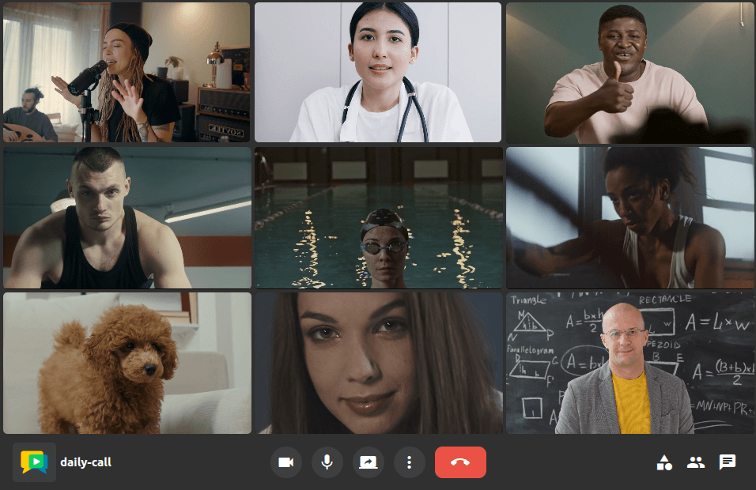
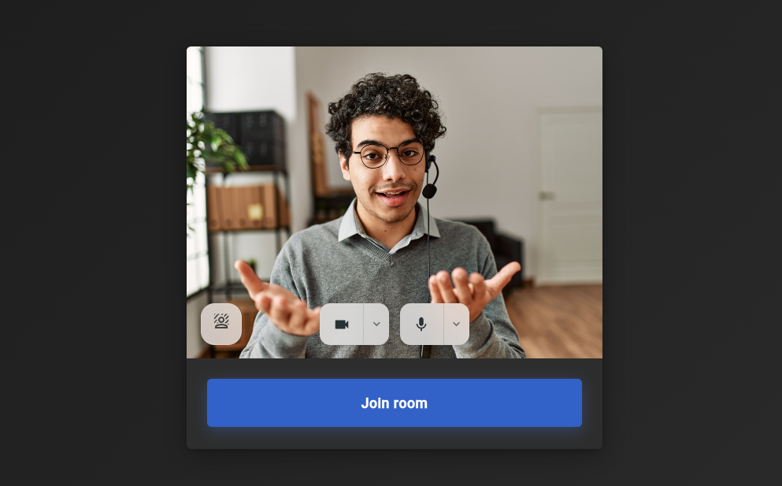
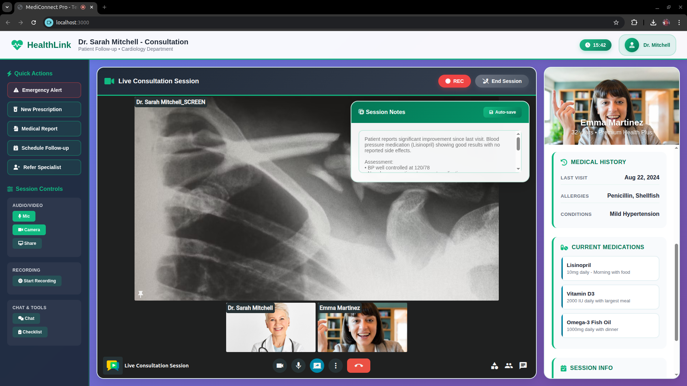

## Intro { .hide-without-display }

<div>
<h1 class="logo-header meet-header">


</h1>
</div>

<h2 class="meetplatform-slogan">
Host and customize your own high-quality video calling service in minutes
</h2>

<div class="wow animated animatedFadeInUp fadeInUp">
    <a class="glightbox" href="../assets/videos/meet/meet-demo.mp4" data-type="video" data-desc-position="bottom" data-gallery="gallery1"><video class="round-corners" src="../assets/videos/meet/meet-demo.mp4" loading="lazy" defer muted playsinline autoplay loop async></video></a>
</div>

<div style="text-align: center; margin: 3em 0;" markdown>

[Try OpenVidu Meet Demo :fontawesome-solid-external-link:{.external-link-icon}](https://meet-demo-app.openvidu.io){ .md-button .md-button--primary target="_blank" style="font-size: 1.1em; padding: 0.8em 2em;" }

</div>

<div class="feature-cards" markdown>
<div class="grid cards two-columns wow animated animatedFadeInUp fadeInUp" style="margin: 5em 0 0 0" markdown>

-   :material-video-box:{ .more-padding-icon .ov-meet-commercial-icon } __Feature-rich for videoconferencing__{ .feature-name }

    ---

    OpenVidu Meet brings all the **features** you expect from a professional video calling solution: HD video, HiFi audio, recording, broadcasting, screen sharing, chat, virtual backgrounds, and more.

-   :material-code-tags:{ .more-padding-icon .ov-meet-commercial-icon } __Integrate right into your app__{ .feature-name }

    ---

    OpenVidu Meet can be used out-of-the-box via web, but it also offers everything you need to **embed it into your existing application**: a web component, a REST API and webhooks.

</div>

<div class="grid cards two-columns wow animated animatedFadeInUp fadeInUp" style="margin-top: 0;" markdown>

-   :material-server:{ .more-padding-icon .ov-meet-commercial-icon } __Secure, self-hosted deployments__{ .feature-name }

    ---

    OpenVidu Meet is designed from the ground up to be **self-hosted** on your own servers (AWS and Azure templates also available). It provides the highest level of **privacy and security** for your video calls.

-   :fontawesome-solid-user-md:{ .more-padding-icon .ov-meet-commercial-icon } __Designed for most common use cases__{ .feature-name }

    ---

    OpenVidu Meet perfectly fits most common videoconferencing use cases: **e-learning, telehealth, remote collaboration, customer support**... And you can customize its **branding** to match your organization’s identity.

</div>
</div>

<h2 class="meetplatform-slogan wow animated animatedFadeInUp fadeInUp" style="margin: 3em 0">
Built for all purposes.<br>
Customizable for your particular use case.
</h2>

## Features

<div class="cards no-border no-shadow ov-meet-commercial-feature-cards" markdown>

__Multi-Party smart layout__{ .ov-meet-commercial-card-title .wow .animated .animatedFadeInUp .fadeInUp }

Connect dozens of participants in a room. OpenVidu Meet automatically adapts to provide the best experience.
{.wow .animated .animatedFadeInUp .fadeInUp}

<a class="glightbox" href="../../assets/images/openvidu-call/ov-call-multiparty.png" data-type="image" data-desc-position="bottom" data-gallery="gallery1"></a>

</div>

<div class="grid cards no-border no-shadow ov-call-commercial-feature-cards wow animated animatedFadeInUp fadeInUp" markdown>

- __Pre-join view__{ .ov-meet-commercial-card-title }

    Your users can set up their video/audio devices, virtual background and language before entering the room.

    <a class="glightbox" href="../../assets/images/meet/prejoin.png" data-type="image" data-desc-position="bottom" data-gallery="gallery1"></a>

- __Background filters__{ .ov-meet-commercial-card-title }

    Allow your users to easily replace their video background with a blur effect or an image.

    <a class="glightbox" href="../assets/videos/ov-call-vb.mp4" data-type="video" data-desc-position="bottom" data-gallery="gallery1"><video class="round-corners" src="../assets/videos/ov-call-vb.mp4" loading="lazy" defer muted playsinline autoplay loop async></video></a>

</div>

<div class="cards no-border no-shadow ov-meet-commercial-feature-cards" markdown>

__Record and share__{ .ov-meet-commercial-card-title .wow .animated .animatedFadeInUp .fadeInUp }

OpenVidu Meet offers high-quality recordings and greatly simplifies their storage and access control.
{.wow .animated .animatedFadeInUp .fadeInUp}

<div class="wow animated animatedFadeInUp fadeInUp">
    <a class="glightbox" href="../assets/videos/meet/share-recording.mp4" data-type="video" data-desc-position="bottom" data-gallery="gallery1"><video class="round-corners" src="../assets/videos/meet/share-recording.mp4" loading="lazy" defer muted playsinline autoplay loop async></video></a>
</div>

</div>

<div class="grid cards no-border no-shadow ov-call-commercial-feature-cards wow animated animatedFadeInUp fadeInUp" markdown>

- __Pre-configure your rooms__{ .ov-meet-commercial-card-title }

    Create and customize the behavior of your rooms in a few clicks: look-and-feel, user permissions, recording, chat and more.

    <a class="glightbox" href="../assets/videos/meet/preconfigure-room.mp4" data-type="video" data-desc-position="bottom" data-gallery="gallery1"><video class="round-corners" src="../assets/videos/meet/preconfigure-room.mp4" loading="lazy" defer muted playsinline autoplay loop async></video></a>

- __Share room links__{ .ov-meet-commercial-card-title }

    Unique secure links give access to your rooms with different permission levels.

    <a class="glightbox" href="../assets/videos/meet/meet-share-link.mp4" data-type="video" data-desc-position="bottom" data-gallery="gallery1"><video class="round-corners" src="../assets/videos/meet/meet-share-link.mp4" loading="lazy" defer muted playsinline autoplay loop async></video></a>

</div>

<!-- <div class="cards no-border no-shadow ov-meet-commercial-feature-cards" markdown>

__Recording management__{ .ov-meet-commercial-card-title .wow .animated .animatedFadeInUp .fadeInUp }

Record meetings with different layouts. Generate shareable links and manage access permissions.
{.wow .animated .animatedFadeInUp .fadeInUp}

<div class="wow animated animatedFadeInUp fadeInUp">
    <a class="glightbox" href="../assets/videos/meet/meet-recording-share-dark.mp4" data-type="video" data-desc-position="bottom" data-gallery="gallery1"><video class="round-corners" src="../assets/videos/meet/meet-recording-share-dark.mp4#only-dark" loading="lazy" defer muted playsinline autoplay loop async></video></a>
    <a class="glightbox" href="../assets/videos/meet/meet-recording-share-light.mp4" data-type="video" data-desc-position="bottom" data-gallery="gallery1"><video class="round-corners" src="../assets/videos/meet/meet-recording-share-light.mp4#only-light" loading="lazy" defer muted playsinline autoplay loop async></video></a>
</div>

</div>

<div style="margin-bottom: 6em"></div> -->

---

<h2 class="meetplatform-slogan wow animated animatedFadeInUp fadeInUp" style="margin: 3em 0 3em 0">
With all the features you need to fine-tune your perfect video calling service.
</h2>

<div class="feature-cards" markdown>
<div class="grid cards three-columns wow animated animatedFadeInUp fadeInUp" style="margin-top: 3em; margin-bottom: 0" markdown>

-   :material-cursor-default-click:{ .feature-icon .padding-icon } __One-click video calls__{ .feature-name }

    ---

    Share links to allow users to join video calls. Compatible with any web browser. No installations required.

-   :material-registered-trademark:{ .feature-icon .padding-icon } __Your own branding__{ .feature-name }

    ---

    Deliver a professional experience by customizing OpenVidu Meet with your own domain, branding colors and logo.

-   :material-video-4k-box:{ .feature-icon .padding-icon } __Up to 4K video and HiFi audio__{ .feature-name }

    ---

    Up to 4K video resolution, and crisp audio quality with noise cancellation and echo suppression.

</div>

<div class="grid cards three-columns wow animated animatedFadeInUp fadeInUp" style="margin-top: 0; margin-bottom: 0" markdown>

-   :material-record-rec:{ .feature-icon } __Recording__{ .feature-name }

    ---

    Record your video calls with different layouts. Manage recording permissions and access with ease.

-   :material-monitor-share:{ .feature-icon .padding-icon } __Screen Sharing__{ .feature-name }

    ---

    Screen sharing with the best quality.

-   :material-face-man-shimmer-outline:{ .feature-icon .padding-icon } __Background effects__{ .feature-name }

    ---

    Apply effects to your videos, blurring the background or replacing it with an image.

</div>

<div class="grid cards three-columns wow animated animatedFadeInUp fadeInUp" style="margin-top: 0;" markdown>

-   :material-chat-outline:{ .feature-icon .padding-icon } __Advanced chat__{ .feature-name }

    ---

    OpenVidu Meet integrates an advanced chat with support of rich messages, emojis, reactions and more.

-   :octicons-broadcast-24:{ .feature-icon .padding-icon } __Broadcasting__{ .feature-name .coming-soon-overlay  }

    ---

    OpenVidu Meet allows you to broadcast your video calls to platforms such as YouTube or Twitch.

-   :material-subtitles-outline:{ .feature-icon .padding-icon } __Live Captions__{ .feature-name .coming-soon-overlay }

    ---

    Support for a vast number of speech-to-text providers.

</div>

<div class="grid cards three-columns wow animated animatedFadeInUp fadeInUp" style="margin-top: 0;" markdown>

-   :material-wifi-lock:{ .feature-icon .padding-icon } __E2E Encryption__{ .feature-name .coming-soon-overlay }

    ---

    Avoid man-in-the-middle attacks: only your final users can decrypt the audio, video and chat messages.

-   :material-door-sliding-lock:{ .feature-icon .padding-icon } __Locked rooms__{ .feature-name .coming-soon-overlay }

    ---

    Prevent unwanted guests and require administrator approval to join.

-   :material-file-send:{ .feature-icon .padding-icon } __File sharing__{ .feature-name .coming-soon-overlay }

    ---

    Allow participants to share files during calls with a simple drag and drop.

</div>

</div>

<hr style="margin: 4em 0">

## Integrations

OpenVidu Meet can be easily integrated with your existing applications and workflows:

<div class="cards no-border no-shadow ov-meet-commercial-feature-cards wow animated animatedFadeInUp fadeInUp" markdown>

__Pre-built web component__{ .ov-meet-commercial-card-title }

Embed the OpenVidu Meet UI right into your app.

<a class="glightbox" href="../assets/videos/meet/embed-html.mp4" data-type="video" data-desc-position="bottom" data-gallery="gallery1"><video class="round-corners" src="../assets/videos/meet/embed-html.mp4" loading="lazy" defer muted playsinline autoplay loop async></video></a>

<a class="glightbox" href="../assets/images/meet/embedded/webcomponent-meeting.png" data-type="image" data-desc-position="bottom" data-gallery="gallery1"></a>

</div>

<div class="cards no-border no-shadow ov-meet-commercial-feature-cards wow animated animatedFadeInUp fadeInUp commercial-code-blocks" markdown>

__REST API and webhooks__{ .ov-meet-commercial-card-title }

Control your meetings from your backend.

```bash
curl --request POST \
    --url https://YOUR_DOMAIN/api/v1/rooms \
    --header 'Accept: application/json' \
    --header 'Content-Type: application/json' \
    --header 'X-API-KEY: YOUR_API_KEY' \
    --data '{"roomName": "my-room"}'
```

</div>

<hr style="margin: 4em 0">

## Deployments

Self-host OpenVidu Meet on your own infrastructure for maximum security and cost-effectiveness. It is easy to deploy, protect, maintain, and scale. No advanced DevOps skills are required to run it in production.

<div class="feature-cards" markdown>
<div class="grid cards two-columns wow animated animatedFadeInUp fadeInUp" style="margin: 5em 0 0 0" markdown>

-   :material-server:{ .more-padding-icon .ov-meet-commercial-icon .bare-metal-icon } __On Premises__{ .feature-name }

    ---

    Deploy on your own bare-metal servers

-   :material-aws:{ .more-padding-icon .ov-meet-commercial-icon .aws-icon } __AWS__{ .feature-name }

    ---

    Deploy with AWS CloudFormation

-   :material-microsoft-azure:{ .more-padding-icon .ov-meet-commercial-icon .azure-icon } __Azure__{ .feature-name }

    ---

    Deploy with Azure Resource Manager

-   :material-google-cloud:{ .more-padding-icon .ov-meet-commercial-icon .gcp-icon } __GCP__{ .feature-name }

    ---

    Deploy in GCP with Terraform

</div>
</div>

<h2 class="meetplatform-slogan wow animated animatedFadeInUp fadeInUp" style="margin: 3em 0 3em 0">
Check out the <a href="./deployment/overview"><strong>deployment documentation</strong></a>.
</h2>

<hr style="margin: 4em 0">

## Use cases

<div class="carousel wow animated animatedFadeInUp fadeInUp" data-flickity='{ "wrapAround": true, "adaptiveHeight": true, "hash": true }' markdown>
<div class="carousel-cell" markdown>
<div class="carousel-cell-content" markdown>
Team meetings
{.fake-title}

Empower collaboration across your organization with customizable, secure, high-quality video meetings.

<div class="grid cards use-cases-inner-cards no-border no-shadow" markdown>

<a class="glightbox" href="../assets/images/meet/multiparty.png" data-type="image" data-desc-position="bottom" data-gallery="gallery1"></a>

-	OpenVidu Meet is the perfect tool for **collaborative work**. With its user-friendly interface and powerful features, teams can easily connect, share ideas, and make decisions in real-time.

</div>

<div class="grid cards use-cases-cards three-columns" style="margin-top: 0; margin-bottom: 0" markdown>

-   __Collaboration tools__{ .feature-name }

    ---

    Screen sharing with top-tier quality, advanced chat with rich features, file sharing and more.

-   __Quick access and flexibility__{ .feature-name }

    ---

    One-click join via secure room links. No installation required, full support for any web browser.

-   __Custom branding__{ .feature-name }

    ---

    Achieve a professional look and feel with customizable domain, colors and logo.

</div>
</div>
</div>

<div class="carousel-cell" markdown>
<div class="carousel-cell-content" markdown>
e-Learning
{.fake-title}

Deliver a seamless learning experience by embedding OpenVidu Meet in your LMS or e-learning portal using **OpenVidu Meet Embedded**.

<div class="grid cards use-cases-inner-cards no-border no-shadow" markdown>

-	With OpenVidu Meet **instructors** can engage with **students** through high quality video & audio, as well as advanced interactive tools. Locked rooms, breakout groups and many more features to enhance the learning experience.

<a class="glightbox" href="../../assets/images/meet/embedded/webcomponent-elearning.png" data-type="image" data-desc-position="bottom" data-gallery="gallery1"></a>

</div>

<div class="grid cards use-cases-cards three-columns" style="margin-top: 0; margin-bottom: 0" markdown>

-   __High quality media__{ .feature-name }

    ---

    Up to **4K** video and **HiFi** audio for crystal-clear lessons. Stable experience across all kind of network thanks to **simulcast**, **SVC**, **dynacast** and **adaptive streaming**.

-   __Accessibility__{ .feature-name }

    ---

    Live captions and real-time transcriptions. OpenVidu Meet is localized in multiple languages.

-   __Persistence and continuity__{ .feature-name }

    ---

    Record and share lessons with multiple layouts. Manage recordings and share via secure links.

</div>
</div>
</div>

<div class="carousel-cell" markdown>
<div class="carousel-cell-content" markdown>
Telehealth
{.fake-title}

The most secure videoconference platform is the one you host on your own servers.

<div class="grid cards use-cases-inner-cards no-border no-shadow" markdown>

<a class="glightbox" href="../../assets/images/meet/embedded/webcomponent-telehealth.png" data-type="image" data-desc-position="bottom" data-gallery="gallery1"></a>

-	OpenVidu Meet is the ideal solution for telehealth services. **Practitioners** can conduct remote consultations, share medical documents, and ensure **patient** privacy with end-to-end encryption.

</div>

<div class="grid cards use-cases-cards three-columns" style="margin-top: 0; margin-bottom: 0" markdown>

-   __Security and privacy__{ .feature-name }

    ---

    End-to-end encryption for audio, video, and chat. Locked rooms and administrator-controlled access. No third-party data routing.

-   __Accessibility and trust__{ .feature-name }

    ---

    Browser-based with no installation needed. Live Captions and real-time transcriptions with specific support for medical language models.

-   __Communication and clarity__{ .feature-name }

    ---

    Up to 4K and HiFi audio for clear communication between practitioners and patients. File sharing for medical documents and images.

</div>
</div>
</div>

<div class="carousel-cell" markdown>
<div class="carousel-cell-content" markdown>
Customer support
{.fake-title}

Build trust with instant, reliable support through embedded video calls that persist. Right where your clients need it.

<div class="grid cards use-cases-inner-cards no-border no-shadow" markdown>

-	Connecting your **remote assistance** team with your **customers** has never been so easy. OpenVidu Meet provides all the necessary tools for effective communication and collaboration, ensuring a seamless support experience.

<a class="glightbox" href="../../assets/images/meet/embedded/webcomponent-meeting.png" data-type="image" data-desc-position="bottom" data-gallery="gallery1"></a>

</div>

<div class="grid cards use-cases-cards three-columns" style="margin-top: 0; margin-bottom: 0" markdown>

-   __Ease of access__{ .feature-name }

    ---

    Simple, one-click access via web: embed support rooms directly into your platform.

-   __Record assistance__{ .feature-name }

    ---

    Record your customer support meetings and generate transcriptions for future reference.

-   __Custom branding__{ .feature-name }

    ---

    Customize the look and feel of your support rooms to match your brand identity.

</div>
</div>
</div>

</div>

<hr style="margin: 5em 0 2em 0">

## Free open-source edition vs Commercial edition

OpenVidu Meet is available in two editions:

### OpenVidu <span class="openvidu-tag openvidu-community-tag" style="font-size: 0.9em; vertical-align: top">COMMUNITY</span>

It is completely **open-source and free to use**. It includes all the features you need for your video conferencing solution. Everything listed in the [Features](#features) section is available in OpenVidu Meet COMMUNITY: HD video, HiFi audio, recording, screen sharing, advanced chat, virtual backgrounds, and more.

OpenVidu Meet COMMUNITY is perfect for production deployments with moderate user load. It can be easily deployed on your own servers, and you can customize its branding to match your organization’s identity. If necessary, upgrading to OpenVidu PRO is seamless and non-disruptive.

### OpenVidu <span class="openvidu-tag openvidu-pro-tag" style="font-size: 0.9em; vertical-align: top">PRO</span>

It is OpenVidu's **commercial edition** and requires a license. It is meant for high demanding environments with significant user load. On top of every functional feature available in OpenVidu COMMUNITY, OpenVidu PRO brings **2x performance**, **advanced observability**, **scalability** and **fault tolerance** features. As well as **priority support** from our team of experts.

OpenVidu PRO follows a simple pricing model based on the size of your deployment (number of CPU cores). Check the [OpenVidu pricing page](https://openvidu.io/pricing) for more details.

<h2 class="meetplatform-slogan wow animated animatedFadeInUp fadeInUp" style="margin: 2em 0 4em 0">
You can choose the OpenVidu edition that best fits your needs when <a href="./deployment/overview">deploying OpenVidu Meet</a>.
</h2>

<hr style="margin: 5em 0 2em 0">

## What does it mean that OpenVidu Meet is in BETA?

OpenVidu Meet (v3.4.1) is considered in **BETA**. There may be bugs and its APIs are subject to change. We are actively working on adding new features, improving existing ones, and fixing any issues that arise. Your feedback is invaluable to us during this phase, so please don't hesitate to [reach out](../support.md) with any comments or suggestions.

<hr style="margin: 5em 0 2em 0">

<h2 class="meetplatform-slogan wow animated animatedFadeInUp fadeInUp" style="margin: 4em 0">
Need total control and advanced SDKs to build your custom real-time application?
Checkout <a href="../docs" target="_blank"><strong>OpenVidu Platform</strong></a>
</h2>