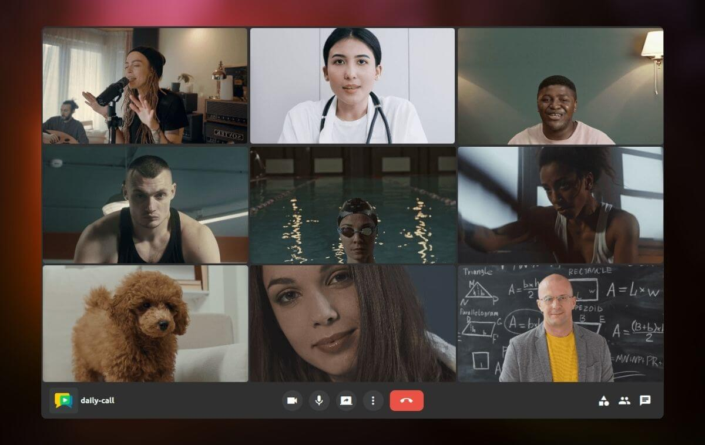

## Intro { .hide-without-display }

<h1 class="logo-header meet-header">

</h1>

<h2 class="meetplatform-slogan">
Host and customize your own high-quality video calling service in minutes
</h2>

-   :material-server:{ .more-padding-icon .ov-meet-commercial-icon } __Host on your servers__{ .feature-name }

    ---

    OpenVidu Meet is designed from the ground up to be [**self-hosted**](docs/self-hosting/production-ready/index.md){.no-break} on your own servers. AWS and Azure templates are also available.

-   :material-timer-sand:{ .padding-icon .ov-meet-commercial-icon } __Easy to deploy__{ .feature-name }

    ---

    OpenVidu Meet is easy to deploy, protect, mantain and scale. No advanced DevOps skills are required to run it in production.

-   :material-security:{ .more-padding-icon .ov-meet-commercial-icon } __Private and secure__{ .feature-name }

    ---

    With OpenVidu Meet you can comply with the highest safety standards. No data flows through third-party servers.

-   :material-format-paint:{ .padding-icon .ov-meet-commercial-icon } __Quick integration and customization__{ .feature-name }

    ---

    OpenVidu Meet can be used out-of-the-box and customized view web. Or embed OpenVidu Meet in your existing web or mobile app using the [**REST API**]().

<h2 class="meetplatform-slogan wow animated animatedFadeInUp fadeInUp" style="margin: 6em 0">
Built for all purposes. 
Customizable for your particular use case.
</h2>

## Gallery { .hide-without-display }

__Multi-Party smart layout__{ .ov-meet-commercial-card-title .wow .animated .animatedFadeInUp .fadeInUp }

Connect dozens of participants in a room. OpenVidu Meet automatically adapts to provide the best experience.
{.wow .animated .animatedFadeInUp .fadeInUp}

{.round-corners}

- __Pre-join view__{ .ov-meet-commercial-card-title }

    Allow your users to setup their video/audio devices, language and other preferences before entering the room.

    {.round-corners}

- __Background filters__{ .ov-meet-commercial-card-title }

    Connect dozens of participants in a room. OpenVidu Meet automatically adapts to provide the best experience.<video class="round-corners" src="../assets/videos/ov-call-vb.mp4" defer muted playsinline autoplay loop async style="margin-top: 1em"></video>

__Pre-configure your rooms __{ .ov-meet-commercial-card-title .wow .animated .animatedFadeInUp .fadeInUp }

Create and customize the behavior of your rooms in a few clicks: user permissions, recording, chat and more.
{.wow .animated .animatedFadeInUp .fadeInUp}

    <video class="round-corners" src="../assets/videos/meet/meet-rooms-dark.mp4#only-dark" defer muted playsinline autoplay loop async></video>
    <video class="round-corners" src="../assets/videos/meet/meet-rooms-light.mp4#only-light" defer muted playsinline autoplay loop async></video>

- __Share room links__{ .ov-meet-commercial-card-title }

    Unique secure links give access to your rooms with different permission levels<video class="round-corners" src="../assets/videos/meet/meet-share-link.mp4" defer muted playsinline autoplay loop async style="margin-top: 1em"></video>

- __Embed OpenVidu Meet in your app__{ .ov-meet-commercial-card-title }

    Use OpenVidu Meet Embedded API to integrate OpenVidu Meet in your existing application.

    {.round-corners}
    {.round-corners}

__Recording management__{ .ov-meet-commercial-card-title .wow .animated .animatedFadeInUp .fadeInUp }

Record meetings with different layouts. Generate shareable links and manage access permissions.
{.wow .animated .animatedFadeInUp .fadeInUp}

    <video class="round-corners" src="../assets/videos/meet/meet-recording-share-dark.mp4#only-dark" defer muted playsinline autoplay loop async></video>
    <video class="round-corners" src="../assets/videos/meet/meet-recording-share-light.mp4#only-light" defer muted playsinline autoplay loop async></video>

---

## List of features { .hide-without-display }
<h2 class="meetplatform-slogan wow animated animatedFadeInUp fadeInUp" style="margin: 3em 0 3em 0">
With all the features you need to fine-tune your perfect video calling service
</h2>

-   :material-cursor-default-click:{ .feature-icon .padding-icon } __One-click video calls__{ .feature-name }

    ---

    Share links to allow users to join video calls. Compatible with any web browser. No installations required.

-   :material-registered-trademark:{ .feature-icon .padding-icon } __Your own branding__{ .feature-name }

    ---

    Deliver a professional experience by customizing OpenVidu Meet with your own domain, branding colors and logo.

-   :material-video-4k-box:{ .feature-icon .padding-icon } __Up to 4K video and HiFi audio__{ .feature-name }

    ---

    Up to 4K video resolution, and crisp audio quality with noise cancellation and echo suppression.

-   :material-record-rec:{ .feature-icon } __Recording__{ .feature-name }

    ---

    Record your video calls with different layouts. Manage recording permissions and access with ease.

-   :octicons-broadcast-24:{ .feature-icon .padding-icon } __Broadcasting__{ .feature-name }

    ---

    OpenVidu Meet allows you to broadcast your video calls to platforms such as YouTube or Twitch.

-   :material-face-man-shimmer-outline:{ .feature-icon .padding-icon } __Background effects__{ .feature-name }

    ---

    Apply effects to your videos, blurring the background or replacing it with an image.

-   :material-monitor-share:{ .feature-icon .padding-icon } __Screen Sharing__{ .feature-name }

    ---

    Screen sharing with the best quality.

-   :material-chat-outline:{ .feature-icon .padding-icon } __Advanced chat__{ .feature-name }

    ---

    OpenVidu Meet integrates an advanced chat with support of rich messages, emojis, reactions and more.

-   :material-subtitles-outline:{ .feature-icon .padding-icon } __Live Captions__{ .feature-name }

    ---

    Support for a vast number of speech-to-text providers.

-   :material-wifi-lock:{ .feature-icon .padding-icon } __E2E Encryption__{ .feature-name }

    ---

    Avoid man-in-th-middle attacks: only your final users can decrypt the audio, video and chat messages.

-   :material-door-sliding-lock:{ .feature-icon .padding-icon } __Locked rooms__{ .feature-name }

    ---

    Prevent unwanted guests and require administrator approval to join.

-   :material-file-send:{ .feature-icon .padding-icon } __File sharing__{ .feature-name }

    ---

    Allow participants to share files during calls with a simple drag and drop.

## Use cases

Team meetings
{.fake-title}

Empower collaboration across your organization with customizable, secure, high-quality video meetings.

{.round-corners .do-not-include-in-gallery .not-selectable}

-	OpenVidu Meet is the perfect tool for **collaborative work**. With its user-friendly interface and powerful features, teams can easily connect, share ideas, and make decisions in real-time.

-   __Collaboration tools__{ .feature-name }

    ---

    Screen sharing with top-tier quality, advanced chat with rich features, file sharing and more.

-   __Quick access and flexibility__{ .feature-name }

    ---

    One-click join via secure room links. No installation required, full support for any web browser.

-   __Custom branding__{ .feature-name }

    ---

    Achieve a professional look and feel with customizable domain, colors and logo.

e-Learning
{.fake-title}

Deliver a seamless learning experience by embedding OpenVidu Meet in your LMS or e-learning portal using **OpenVidu Meet Embedded**.

-	With OpenVidu Meet **instructors** can engage with **students** through high quality video & audio, as well as advanced interactive tools. Locked rooms, breakout groups and many more features to enhance the learning experience.

{.round-corners .do-not-include-in-gallery .not-selectable}

-   __High quality media__{ .feature-name }

    ---

    Up to 4K video and HiFi audio for crystal-clear lessons. Stable experience across all kind of network thanks to simulcast, SVC, dynacast and adaptive streaming.

-   __Accessibility__{ .feature-name }

    ---

    Live captions and real-time transcriptions. OpenVidu Meet is localized in multiple languages.

-   __Persistence and continuity__{ .feature-name }

    ---

    Record and share lessons with multiple layouts. Manage recordings and share via secure links.

Telehealth
{.fake-title}

The most secure videoconference platform is the one you host on your own servers.

{.round-corners .do-not-include-in-gallery .not-selectable}

-	OpenVidu Meet is the ideal solution for telehealth services. **Practitioners** can conduct remote consultations, share medical documents, and ensure **patient** privacy with end-to-end encryption.

-   __Security and privacy__{ .feature-name }

    ---

    End-to-end encryption for audio, video, and chat. Locked rooms and administrator-controlled access. No third-party data routing.

-   __Accessibility and trust__{ .feature-name }

    ---

    Browser-based with no installation needed. Live Captions and real-time transcriptions with specific support for medical language models.

-   __Communication and clarity__{ .feature-name }

    ---

    Up to 4K and HiFi audio for clear for clear communication between practitioners and patients. File sharing for medical documents and images.

Customer support
{.fake-title}

Build trust with instant, reliable support through embedded video calls that persist. Right where your clients need it.

-	Connecting your **remote assistance** team with your **customers** has never been so easy. OpenVidu Meet provides all the necessary tools for effective communication and collaboration, ensuring a seamless support experience.

{.round-corners .do-not-include-in-gallery .not-selectable}

-   __Ease of access__{ .feature-name }

    ---

    Simple, one-click access via web: embed support rooms directly into your platform.

-   __Record assistance__{ .feature-name }

    ---

    Record your customer support meetings and generate transcriptions for future reference.

-   __Communication and clarity__{ .feature-name }

    ---

    Up to 4K and HiFi audio for clear for clear communication between practitioners and patients. File sharing for medical documents and images.

