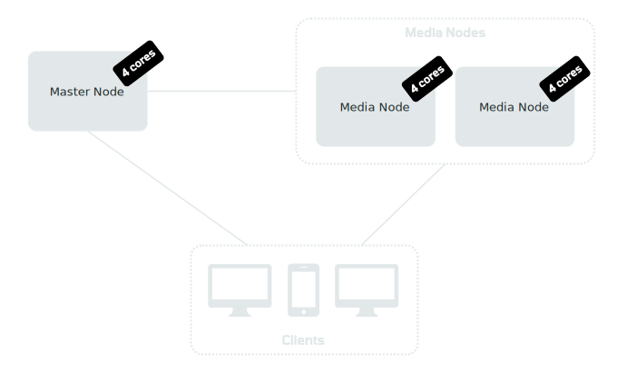
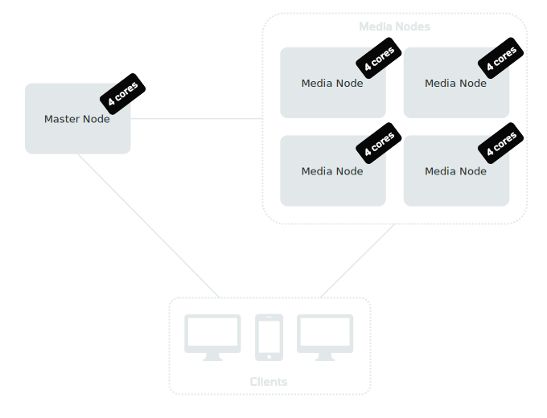
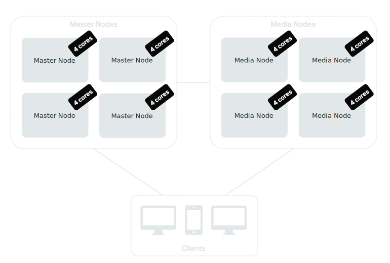
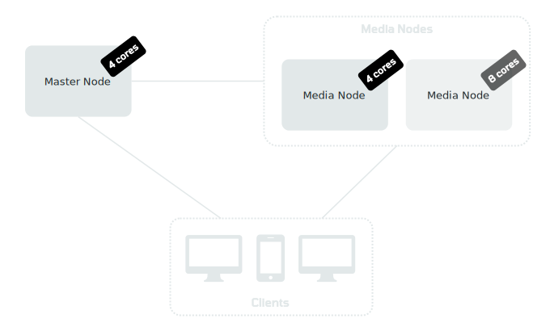

# Pricing

<table id="pricing-table" name="big-pricing-table">
  <tr>
    <th></th>
    <th class="border-right border-left title"><strong style="white-space: nowrap">OpenVidu COMMUNITY</strong></th>
    <th colspan="2" class="title"><strong style="white-space: nowrap">OpenVidu PRO</strong></th>
  </tr>
  <tr>
    <td class="first-column border-right">Price</td>
    <td class="border-right price-cell">Free</td>
    <td colspan="2" class="border-right price-cell">
0.0006$ core/minute

Free while in beta! <a href="#free-tier-info">*</a>
</td>
  </tr>
  <tr>
    <td class="first-column border-right">Type of deployment</td>
    <td class="border-right"><a href="/docs/self-hosting/deployment-types/#openvidu-single-node"><strong>OpenVidu Single Node</strong></a></td>
    <td class="border-right"><a href="/docs/self-hosting/deployment-types/#openvidu-elastic"><strong>OpenVidu Elastic</strong></a></td>
    <td><a href="/docs/self-hosting/deployment-types/#openvidu-high-availability"><strong>OpenVidu High Availability</strong></a></td>
  </tr>
  <tr>
    <td class="first-column border-right">Suitability</td>
    <td class="border-right">For applications with medium user load</td>
    <td class="border-right">For applications with dynamic user load that require scalability</td>
    <td>For applications where both scalability and fault tolerance are critical</td>
  </tr>
  <tr>
    <td class="first-column border-right">Features</td>
    <td class="border-right">Custom LiveKit distribution with Redis, Egress, Ingress, S3 storage and observability</td>
    <td class="border-right">Same benefits as OpenVidu Single Node plus <strong style="white-space: nowrap">2x performance</strong>, <strong>scalability</strong> and <strong>advanced observability</strong></td>
    <td>Same benefits as OpenVidu Single Node and OpenVidu Elastic plus <strong style="white-space: nowrap">fault tolerance</strong></td>
  </tr>
  <tr>
    <td class="first-column border-right">Number of servers</td>
    <td class="border-right">1 Node</td>
    <td class="border-right">1 Master Node + N Media Nodes</td>
    <td> 4 Master Nodes + N Media Nodes</td>
  </tr>
  <tr>
    <td class="first-column border-right">Installation instructions</td>
    <td class="border-right"><a class="md-button" href="/docs/self-hosting/single-node/">Install</a></td>
    <td class="border-right"><a class="md-button" href="/docs/self-hosting/elastic/">Install</a></td>
    <td><a class="md-button" href="/docs/self-hosting/ha/">Install</a></td>
  </tr>
</table>

!!! info "About OpenVidu Pro free beta period"

    - OpenVidu Pro is currently in **beta** and will remain completely free until GA.
    - All users running a beta version of OpenVidu Pro **will be notified** weeks before the free beta period ends, giving time to upgrade to the final GA version if desired.
    - Active OpenVidu Pro clusters in beta version **will eventually shut down automatically** after the free beta period ends.

## How is OpenVidu Pro priced?

OpenVidu Pro follows a simple pricing model based on the number of cores used by the OpenVidu Pro cluster:

$0.0006

per core per minute available 
for your OpenVidu PRO cluster

Taking into account the following points:

- You only pay for your OpenVidu Pro cluster(s) for the time they are running. Usage will be registered the moment you start your cluster and will stop as soon as you shut your cluster down. When turned on, your cluster will be charged even in idle state (without active Rooms).
- You pay for every available core at any given time: if you cluster grows for one hour, that hour you will pay more. If your cluster decreases the next hour, next hour will be cheaper. Master Nodes and Media Nodes have the same core per minute price.
- Your OpenVidu Pro cluster(s) need to allow outbound traffic to domain **`accounts.openvidu.io`** port **`443`**. If you are behind a very restrictive corporate firewall that doesn't allow this, please contact us through [commercial@openvidu.io](mailto:commercial@openvidu.io){:target=_blank}.

  <h2 style="margin-bottom: 1em">There is a 15-day free trial period waiting for you!</h2>
  

    <a href="/account/" class="md-button home-secondary-button">Get an OpenVidu License</a>
  

---

## Why is OpenVidu Pro priced like this?

There are deliberate reasons for this pricing model in OpenVidu Pro:

- We believe that a platform specifically designed to be self-hosted should have a pricing model that is as close to hardware as possible: that is the total number of cores available to the cluster over time.
- This pricing model is simple, transparent and easy to predict: you pay only for the time the cluster is running and always according to its size.
- The cost is directly proportional to the size of your cluster: larger clusters pay more, smaller clusters pay less.
- Elasticity is encouraged: adjust the size of your cluster according to the load at any given time to minimize costs.

## When and how are you charged?

Users must create an [OpenVidu account](account.md) and get an OpenVidu License. This license will be required to deploy an OpenVidu Pro cluster ([OpenVidu Elastic](docs/self-hosting/elastic/index.md) or [OpenVidu High Availability](docs/self-hosting/ha/index.md)).

When purchasing an OpenVidu License, you will have to indicate your billing address and a credit card. You will receive a **15-day free trial period** during which you will not be charged at all.

After the free trial period, a **monthly billing cycle** will charge all your expenses to your credit card. Therefore, you will receive an invoice each month. You can review your upcoming expenses and your past invoices in your [OpenVidu account](account.md) page. And don't worry: we don't store any credit card data. The entire billing process is securely done via [Stripe](https://stripe.com/){:target=_blank}.

OpenVidu Pro clusters will automatically report their usage on a recurring basis. That's why they need outbound access to domain **`accounts.openvidu.io`** port **`443`**. If you are behind a very restrictive corporate firewall that doesn't allow this, please contact us through [commercial@openvidu.io](mailto:commercial@openvidu.io){:target=_blank}.

## Pricing examples

As explained above, every minute of an OpenVidu Pro cluster is charged according to the number of cores available for the cluster. So let's see some actual examples, first noting the following points:

- The examples represent a **continuous usage of the cluster**, but remember that you can shut it down whenever you are not using it and that you can drop nodes to save resources.
- Each example shows in a table the price for **8 hours, 1 day and 1 month** of continuous usage, as well as the approximated amount of video Tracks and Rooms of 8 participants the cluster would support. This is done to provide a basic insight into the capacity of each cluster. These **8-to-8 Rooms** assume 64 video Tracks (640x480) and 64 audio Tracks in them (2 tracks published and 14 tracks subscribed per Participant), with no Egress, Ingress or other additional features.

### OpenVidu Elastic with 12 cores in total

This OpenVidu Pro Elastic cluster has 1 Master Node of 4 cores and 2 Media Nodes of 4 cores each.

|||
|---|---|
| **Number of video Tracks** | 2000 :material-information-outline:{ title="640x480 video. Same number of audio Tracks are also transmitted" } |
| **Number of Rooms with 8 Participants** |  250 |
| **8 hours** | $3.46 :material-information-outline:{ title="8 hours * 60 minutes/hour * 12 cores * $0.0006 = $3.45" } |
| **24 hours** (1 day of uninterrupted use) | $10.37 :material-information-outline:{ title="24 hours * 60 minutes/hour * 12 cores * $0.0006 = $10.37" } |
| **720 hours** (1 month of uninterrupted use) | $311.04 :material-information-outline:{ title="720 hours * 60 minutes/hour * 12 cores * $0.0006 = $311.04" } |

<figure>

</figure>

---

### OpenVidu Elastic with 20 cores in total

This OpenVidu Pro Elastic cluster has 1 Master Node of 4 cores and 4 Media Nodes of 4 cores each.

|||
|---|---|
| **Number of video Tracks** | 4000 :material-information-outline:{ title="640x480 video. Same number of audio Tracks are also transmitted" } |
| **Number of Rooms with 8 Participants** |  500 |
| **8 hours** | $5.76 :material-information-outline:{ title="8 hours * 60 minutes/hour * 20 cores * $0.0006 = $5.76" } |
| **24 hours** (1 day of uninterrupted use) | $17.28 :material-information-outline:{ title="24 hours * 60 minutes/hour * 20 cores * $0.0006 = $17.28" } | 
| **720 hours** (1 month of uninterrupted use) | $518.40 :material-information-outline:{ title="720 hours * 60 minutes/hour * 20 cores * $0.0006 = $518.40" } |

<figure>

</figure>

---

### OpenVidu High Availability with 32 cores in total

This OpenVidu Pro HA cluster has 4 Master Nodes of 4 cores each and 4 Media Nodes of 4 cores each. The number of simultaneous Rooms and Tracks will be the same as in the previous example, but this cluster will provide fault tolerance thanks to the replication of the Master Nodes.

|||
|---|---|
| **Number of video Tracks** | 4000 :material-information-outline:{ title="640x480 video. Same number of audio Tracks are also transmitted" } |
| **Number of Rooms with 8 Participants** |  500 |
| **8 hours** | $9.21 :material-information-outline:{ title="8 hours * 60 minutes/hour * 32 cores * $0.0006 = $9.21" } |
| **24 hours** (1 day of uninterrupted use) | $27.65 :material-information-outline:{ title="24 hours * 60 minutes/hour * 32 cores * $0.0006 = $27.65" } | 
| **720 hours** (1 month of uninterrupted use) | $829.44 :material-information-outline:{ title="720 hours * 60 minutes/hour * 32 cores * $0.0006 = $829.44" } |

<figure>

</figure>

---

### OpenVidu Elastic with a variable number of cores

This OpenVidu Pro Elastic cluster takes advantage of the elasticity of the platform. It has a fixed Master Node of 4 cores, but a variable number of Media Nodes. Let's imagine a scenario where our days are divided in three phases according to the user load:

- First 8 hours of the day the demand is low. 1 Media Node of 4 cores is enough to handle it.
- The next 8 hours of the day the user load increases significantly (this is very typical if our application is used more during working hours). We add another Media Node of 8 cores to handle this new demand.
- The last 8 hours of the day the demand decreases, and we are able to remove the Media Node of 8 cores and keep only the Media Node of 4 cores.

|||
|---|---|
| **First 8 hours of the day with low demand** (8 cores in total) | <table class="inner-table" markdown><thead markdown><tr markdown><th>Video Tracks</th><th markdown>1000 :material-information-outline:{ title="640x480 video. Same number of audio Tracks are also transmitted" }</th></tr></thead><tbody><tr><td>8x8 Rooms</td><td>125</td></tr><tr><td>Price</td><td markdown>$2.30 :material-information-outline:{ title="8 hours * 60 minutes/hour * 8 cores * $0.0006 = $2.30" }</td></tr></tbody></table> |
| **Next 8 hours of the day with high demand** (16 cores in total) | <table class="inner-table" markdown><thead markdown><tr markdown><th>Price</th><th markdown>$4.61 :material-information-outline:{ title="8 hours * 60 minutes/hour * 16 cores * $0.0006 = $4.61" }</th></tr></thead><tbody><tr><td>Video Tracks</td><td markdown>3000 :material-information-outline:{ title="640x480 video. Same number of audio Tracks are also transmitted" }</td></tr><tr><td>8x8 Rooms</td><td>375</td></tr></tbody></table> |
| **Last 8 hours of the day with low demand** (8 cores in total) | <table class="inner-table" markdown><thead markdown><tr markdown><th>Price</th><th markdown>$2.30 :material-information-outline:{ title="8 hours * 60 minutes/hour * 8 cores * $0.0006 = $2.30" }</th></tr></thead><tbody><tr><td>Video Tracks</td><td markdown>1000 :material-information-outline:{ title="640x480 video. Same number of audio Tracks are also transmitted" }</td></tr><tr><td>8x8 Rooms</td><td>125</td></tr></tbody></table>  |
| **Total for 1 day** | $9.21 |
| **Total for 1 month** | $276.30 |

<figure>

</figure>

---

  <h2 style="margin-bottom: 1em">There is a 15-day free trial period waiting for you!</h2>
  

    <a href="/account/" class="md-button home-secondary-button">Get an OpenVidu License</a>
  

