<style>
  /* Publication type badges */
  .pub-badge {
    display: inline-block;
    padding: 0.1em 0.65em;
    border-radius: 1em;
    font-size: 0.7rem;
    font-weight: 700;
    letter-spacing: 0.02em;
    white-space: nowrap;
    vertical-align: middle;
  }
  .pub-phdthesis     { background: #ede7f6; color: #4527a0; }
  .pub-journal    { background: #e3f2fd; color: #0d47a1; }
  .pub-conference { background: #e8f5e9; color: #1b5e20; }

  [data-md-color-scheme="slate"] .pub-phdthesis     { background: rgba(124, 77, 255, 0.22); color: #d1c4e9; }
  [data-md-color-scheme="slate"] .pub-journal    { background: rgba(33, 150, 243, 0.22); color: #90caf9; }
  [data-md-color-scheme="slate"] .pub-conference { background: rgba(76, 175, 80, 0.22);  color: #a5d6a7; }

  /* Index table */
  .research-index table { font-size: 0.85rem; }
  .research-index td:first-child,
  .research-index td:nth-child(2) { white-space: nowrap; text-align: center; vertical-align: middle; }
  .research-index td:first-child { font-variant-numeric: tabular-nums; font-weight: 600; }
  .research-index td small { color: var(--md-default-fg-color--light); }

  /* Per-publication metadata line */
  .pub-meta { font-size: 0.85rem; margin-top: -0.4rem; }
  .pub-meta .pub-sep { color: var(--md-default-fg-color--lighter); margin: 0 0.4em; }
</style>

# OpenVidu research publications

The technology behind OpenVidu is grounded in more than a decade of peer-reviewed research on real-time communications, WebRTC media servers, and the automated testing and Quality of Experience (QoE) assessment of WebRTC applications. This line of work began within the Kurento project and continues today in OpenVidu, led by researchers at [Universidad Rey Juan Carlos :fontawesome-solid-external-link:{.external-link-icon}](https://www.urjc.es/){:target="_blank"} together with collaborating institutions.

The table below lists our publications from newest to oldest. Select any title to jump to its full details, abstract, and citation.

## Index

<div style="display: flex; align-items: center; flex-flow: row wrap; justify-content: center;" markdown>
<div class="research-index" markdown>

| Year | Type | Publication |
|:----:|:----:|:------------|
| 2026 | **PHD Thesis**{ .pub-badge .pub-phdthesis } | [Scalability and Quality of Experience of WebRTC media servers for Large-Scale, Low-Latency Streaming](#scalability-and-quality-of-experience-of-webrtc-media-servers-for-large-scale-low-latency-streaming)<br><small>PHD Thesis — Universidad Rey Juan Carlos</small> |
| 2025 | **Journal**{ .pub-badge .pub-journal } | [Quality of Experience Under Huge Load for WebRTC Applications: A Case Study of Three Media Servers](#quality-of-experience-under-huge-load-for-webrtc-applications-a-case-study-of-three-media-servers)<br><small>IEEE Access</small> |
| 2022 | **Journal**{ .pub-badge .pub-journal } | [Cost-effective load testing of WebRTC applications](#cost-effective-load-testing-of-webrtc-applications)<br><small>Journal of Systems and Software</small> |
| 2020 | **Conference**{ .pub-badge .pub-conference } | [Quality-of-Experience driven configuration of WebRTC services through automated testing](#quality-of-experience-driven-configuration-of-webrtc-services-through-automated-testing)<br><small>IEEE QRS</small> |
| 2020 | **Journal**{ .pub-badge .pub-journal } | [A Survey of the Selenium Ecosystem](#a-survey-of-the-selenium-ecosystem)<br><small>Electronics (MDPI)</small> |
| 2020 | **Journal**{ .pub-badge .pub-journal } | [Assessment of QoE for Video and Audio in WebRTC Applications Using Full-Reference Models](#assessment-of-qoe-for-video-and-audio-in-webrtc-applications-using-full-reference-models)<br><small>Electronics (MDPI)</small> |
| 2019 | **Journal**{ .pub-badge .pub-journal } | [Understanding and estimating quality of experience in WebRTC applications](#understanding-and-estimating-quality-of-experience-in-webrtc-applications)<br><small>Computing (Springer)</small> |
| 2019 | **Journal**{ .pub-badge .pub-journal } | [Practical Evaluation of VMAF Perceptual Video Quality for WebRTC Applications](#practical-evaluation-of-vmaf-perceptual-video-quality-for-webrtc-applications)<br><small>Electronics (MDPI)</small> |
| 2017 | **Conference**{ .pub-badge .pub-conference } | [NUBOMEDIA: The First Open Source WebRTC PaaS](#nubomedia-the-first-open-source-webrtc-paas)<br><small>ACM Multimedia</small> |
| 2017 | **Journal**{ .pub-badge .pub-journal } | [Kurento: The Swiss Army Knife of WebRTC Media Servers](#kurento-the-swiss-army-knife-of-webrtc-media-servers)<br><small>IEEE Communications Standards Magazine</small> |
| 2017 | **Journal**{ .pub-badge .pub-journal } | [WebRTC Testing: Challenges and Practical Solutions](#webrtc-testing-challenges-and-practical-solutions)<br><small>IEEE Communications Standards Magazine</small> |
| 2017 | **Journal**{ .pub-badge .pub-journal } | [Designing and evaluating the usability of an API for real-time multimedia services in the Internet](#designing-and-evaluating-the-usability-of-an-api-for-real-time-multimedia-services-in-the-internet)<br><small>Multimedia Tools and Applications (Springer)</small> |
| 2017 | **Conference**{ .pub-badge .pub-conference } | [WebRTC Testing: State of the Art](#webrtc-testing-state-of-the-art)<br><small>ICSOFT</small> |
| 2016 | **Conference**{ .pub-badge .pub-conference } | [Analysis of Video Quality and End-to-End Latency in WebRTC](#analysis-of-video-quality-and-end-to-end-latency-in-webrtc)<br><small>IEEE Globecom Workshops</small> |
| 2016 | **Conference**{ .pub-badge .pub-conference } | [Kurento: The WebRTC Modular Media Server](#kurento-the-webrtc-modular-media-server)<br><small>ACM Multimedia</small> |
| 2016 | **Conference**{ .pub-badge .pub-conference } | [Testing Framework for WebRTC Services](#testing-framework-for-webrtc-services)<br><small>EAI MobiMedia</small> |
| 2016 | **Conference**{ .pub-badge .pub-conference } | [NUBOMEDIA: An Elastic PaaS Enabling the Convergence of Real-Time and Big Data Multimedia](#nubomedia-an-elastic-paas-enabling-the-convergence-of-real-time-and-big-data-multimedia)<br><small>IEEE SmartCloud</small> |
| 2016 | **Conference**{ .pub-badge .pub-conference } | [Design and Implementation of a High Performant PaaS Platform for Creating Novel Real-Time Communication Paradigms](#design-and-implementation-of-a-high-performant-paas-platform-for-creating-novel-real-time-communication-paradigms)<br><small>IEEE ICIN</small> |
| 2014 | **Journal**{ .pub-badge .pub-journal } | [Authentication, Authorization, and Accounting in WebRTC PaaS Infrastructures: The Case of Kurento](#authentication-authorization-and-accounting-in-webrtc-paas-infrastructures-the-case-of-kurento)<br><small>IEEE Internet Computing</small> |

</div>
</div>

---

<div style="display: flex; align-items: center; flex-flow: row wrap; justify-content: center;" markdown>

<div class="grid-90 tablet-grid-90" markdown>
## [Scalability and Quality of Experience of WebRTC media servers for Large-Scale, Low-Latency Streaming :fontawesome-solid-external-link:{.external-link-icon}](https://dialnet.unirioja.es/servlet/tesis?codigo=402576){:target="_blank"}

Iván Chicano-Capelo[ { loading=lazy width=16 height=16 }](https://orcid.org/0000-0003-1857-9615){ target="_blank" aria-label="View ORCID record - 0000-0003-1857-9615" } (Author), Francisco Gortázar[ { loading=lazy width=16 height=16 }](https://orcid.org/0000-0002-2183-0869){ target="_blank" aria-label="View ORCID record - 0000-0002-2183-0869" } (Supervisor), Micael Gallego[ { loading=lazy width=16 height=16 }](https://orcid.org/0000-0002-2875-7342){ target="_blank" aria-label="View ORCID record - 0000-0002-2875-7342" } (Supervisor)

**PHD Thesis**{ .pub-badge .pub-phdthesis } **Universidad Rey Juan Carlos** · 2026 · Doctoral Program in Information and Communication Technologies (International Doctoral School) · [Full text :fontawesome-regular-file-pdf: :fontawesome-solid-external-link:{.external-link-icon}](https://dialnet.unirioja.es/servlet/tesis?codigo=402576&orden=0&info=link){:target="_blank"}

??? quote "Cite this publication (BibTeX)"

    ```bibtex
    @phdthesis{ChicanoCapelo2026,
      author = {Chicano-Capelo, Iván},
      title  = {Scalability and Quality of Experience of WebRTC media servers for Large-Scale, Low-Latency Streaming},
      school = {Universidad Rey Juan Carlos},
      type   = {Doctoral Thesis},
      year   = {2026},
      url    = {https://dialnet.unirioja.es/servlet/tesis?codigo=402576}
    }
    ```

**Abstract**: Low-Latency Live Streaming (LLLS) has become a cornerstone for interactive applications such as virtual events, gaming, and real-time collaboration. Web Real-Time Communication (WebRTC), originally designed for peer-to-peer communication, is increasingly adopted for LLLS due to its sub-second latency and native browser support. However, scaling WebRTC to thousands of concurrent viewers while preserving the Quality of Experience (QoE) of the users remains challenging.

**Hypothesis**: This thesis posits that WebRTC can be used for massive LLLS scenarios while keeping the QoE of the users at acceptable levels, by analyzing the scalability limits of WebRTC media servers and using this knowledge to effectively interconnect media servers in order to distribute the load efficiently.

**Objectives**: Three research objectives were established: (i) to study and propose load testing strategies for WebRTC applications, (ii) to study QoE degradation in WebRTC media servers under high load, and (iii) to study scaling strategies for LLLS with WebRTC by interconnecting media servers.

**Main results**: Non-browser-based emulation strategies, in particular kms-webrtc, reduce testing costs by up to 96.6% compared to browser-based approaches. QoE analysis under load shows distinct failure modes: Kurento and Pion degrade primarily under CPU saturation, while Mediasoup remains stable until round-trip time (RTT) exceeds approximately ∼0.2 s and jitter ∼0.04 s. Mediasoup supports up to six times more users before QoE degradation than Kurento and nearly twice as many as Pion. Regarding horizontal scalability, media server interconnection introduces negligible latency, allowing us to focus on optimizing server costs. The best presented scalability strategy, which optimizes session, publisher and viewer assignment and per-server capacity reservation, significantly outperforms alternatives in resource utilization and costs through the sharing of media servers among multiple streams and the reservation of a small number of spaces in each server for interconnection with other servers.

**Conclusions**: The results confirm the initial hypothesis and provide practical guidelines, tools, and datasets for designing scalable WebRTC-based low-latency streaming platforms that scale to large audiences while maintaining acceptable QoE. Characterization of scalability limits and the use of media server interconnection as an expansion mechanism are key for planning efficient LLLS deployments.

</div>

<div class="grid-40 tablet-grid-40" markdown="span">
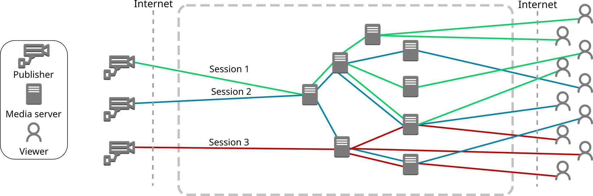{ .round-corners loading=lazy width=2130 height=706 style="padding: 10px; background-color: white;" }
</div>

<div class="grid-40 tablet-grid-40" markdown="span">
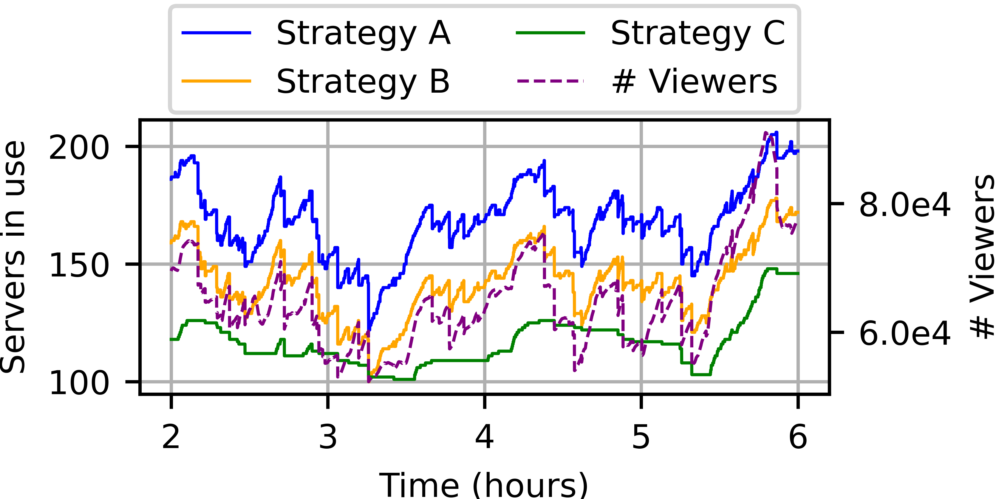{ .round-corners loading=lazy width=1920 height=960 style="padding: 10px; background-color: white;" }
</div>

---

<div class="grid-90 tablet-grid-90" markdown>
## [Quality of Experience Under Huge Load for WebRTC Applications: A Case Study of Three Media Servers :fontawesome-solid-external-link:{.external-link-icon}](https://doi.org/10.1109/ACCESS.2025.3589785){:target="_blank"}

Iván Chicano-Capelo[ { loading=lazy width=16 height=16 }](https://orcid.org/0000-0003-1857-9615){ target="_blank" aria-label="View ORCID record - 0000-0003-1857-9615" }, Francisco Gortázar[ { loading=lazy width=16 height=16 }](https://orcid.org/0000-0002-2183-0869){ target="_blank" aria-label="View ORCID record - 0000-0002-2183-0869" }, Micael Gallego[ { loading=lazy width=16 height=16 }](https://orcid.org/0000-0002-2875-7342){ target="_blank" aria-label="View ORCID record - 0000-0002-2875-7342" }

**Journal**{ .pub-badge .pub-journal } **IEEE Access** · 2025 · [DOI: 10.1109/ACCESS.2025.3589785 :fontawesome-solid-external-link:{.external-link-icon}](https://doi.org/10.1109/ACCESS.2025.3589785){:target="_blank"}

??? quote "Cite this publication (BibTeX)"

    ```bibtex
    @article{ChicanoCapelo2025,
      author  = {Chicano-Capelo, Iván and Gortázar, Francisco and Gallego, Micael},
      title   = {Quality of Experience Under Huge Load for WebRTC Applications: A Case Study of Three Media Servers},
      journal = {IEEE Access},
      volume  = {13},
      pages   = {140440--140461},
      year    = {2025},
      doi     = {10.1109/ACCESS.2025.3589785}
    }
    ```

Videoconference applications are becoming increasingly popular, and the demand for these applications is growing. The availability of a standard for building videoconference application on the web, the W3C WebRTC standard, boosted the development of such applications. With so many alternatives available, an impact on quality due to an overload of such applications might cause users to leave and choose another service instead. This makes stress testing mandatory in order to understand the limits of these videoconference solutions and how these limits impact the quality of experience (QoE) of the users. However, most testing tools are not designed to calculate QoE, which is essential for real-time videoconference applications, because QoE calculation is complex and a computationally intensive process. This paper focuses on how load impacts QoE for WebRTC applications and presents OpenVidu QoE and Load Testing Tool (OQLT), a load and stress testing tool for WebRTC applications which measures the QoE of users in videoconference applications. In this work, we make use of this tool to help researchers and practitioners understand the impact of server load on the QoE of users in WebRTC applications, by analyzing three different communication systems: Kurento, Mediasoup, and Pion. We study which quality of service (QoS) metrics can be used to prevent an impact on the QoE of users in these servers. We also analyze different session sizes and topologies to understand the impact of server load on the QoE of users under different circumstances. Our findings show that in two of the three media servers (Kurento and Pion), CPU alone is a good indicator of QoE degradation, whereas for Mediasoup, additional WebRTC metrics are needed, because under high CPU usage Mediasoup can still provide a good QoE to its users. We also found that the behavior of the three media servers under load with respect to the QoE perceived by users is different, which might be important for practitioners, and that not all users are impacted equally by an overload on the server, and how users are impacted under such a load depends as well on the media server. From our extensive analysis of the data collected, we provide detailed implications for practitioners when using WebRTC applications.

</div>

<div class="grid-40 tablet-grid-40" markdown="span">
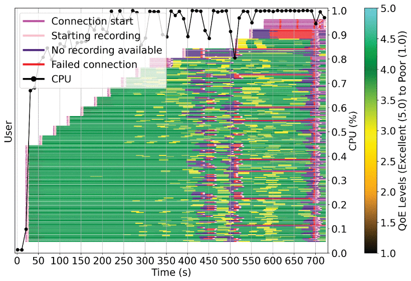{ .round-corners loading=lazy width=820 height=562 }
</div>

<div class="grid-40 tablet-grid-40" markdown="span">
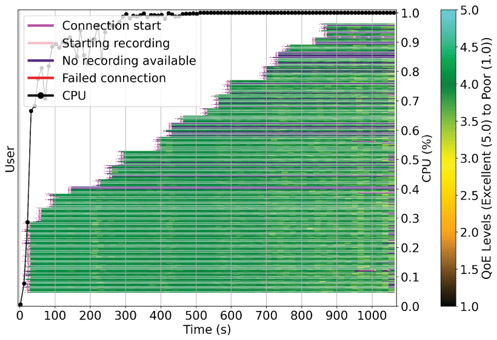{ .round-corners loading=lazy width=820 height=562 }
</div>

---

<div class="grid-90 tablet-grid-90" markdown>
## [Cost-effective load testing of WebRTC applications :fontawesome-solid-external-link:{.external-link-icon}](https://doi.org/10.1016/j.jss.2022.111439){:target="_blank"}

Francisco Gortázar[ { loading=lazy width=16 height=16 }](https://orcid.org/0000-0002-2183-0869){ target="_blank" aria-label="View ORCID record - 0000-0002-2183-0869" }, Micael Gallego[ { loading=lazy width=16 height=16 }](https://orcid.org/0000-0002-2875-7342){ target="_blank" aria-label="View ORCID record - 0000-0002-2875-7342" }, Michel Maes-Bermejo[ { loading=lazy width=16 height=16 }](https://orcid.org/0000-0002-8138-9702){ target="_blank" aria-label="View ORCID record - 0000-0002-8138-9702" }, Iván Chicano-Capelo[ { loading=lazy width=16 height=16 }](https://orcid.org/0000-0003-1857-9615){ target="_blank" aria-label="View ORCID record - 0000-0003-1857-9615" }, Carlos Santos

**Journal**{ .pub-badge .pub-journal } **Journal of Systems and Software** · 2022 · [DOI: 10.1016/j.jss.2022.111439 :fontawesome-solid-external-link:{.external-link-icon}](https://doi.org/10.1016/j.jss.2022.111439){:target="_blank"}

??? quote "Cite this publication (BibTeX)"

    ```bibtex
    @article{Gortazar2022,
      author  = {Gortázar, Francisco and Gallego, Micael and Maes-Bermejo, Michel and Chicano-Capelo, Iván and Santos, Carlos},
      title   = {Cost-effective load testing of WebRTC applications},
      journal = {Journal of Systems and Software},
      volume  = {193},
      pages   = {111439},
      year    = {2022},
      doi     = {10.1016/j.jss.2022.111439}
    }
    ```

**Background**: Video conference applications and systems implementing the WebRTC W3C standard are becoming more popular and demanded year after year, and load testing them is of paramount importance to ensure they can cope with demand. However, this is an expensive activity, usually involving browsers to emulate users.
**Goal**: to propose browser-less alternative strategies for load testing WebRTC services, and to study performance and costs of those strategies when compared with traditional ones.
**Method**:(a) Exploring the limits of existing and novel strategies for load testing WebRTC services from a single machine. (b) Comparing the common strategy of using browsers with the best of our proposed strategies in terms of cost in a load testing scenario.
**Results**: We observed that, using identical machines, our proposed strategies are able to emulate more users than traditional strategies. We also found a huge saving in expenditure for load testing, as our strategy suppose a saving of 96% with respect to usual browser-based strategies. We also found there are almost no differences between the traditional strategies considered.
**Conclusion**: We provide details on scalability of different load testing strategies in terms of users emulated, as well as CPU and memory used. We could reduce the expenditure of load tests of WebRTC applications.

</div>

<div class="grid-40 tablet-grid-40" markdown="span">
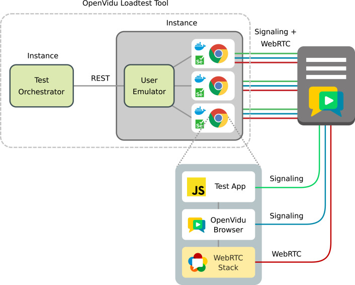{ .control-height .round-corners loading=lazy }
</div>

<div class="grid-40 tablet-grid-40" markdown="span">
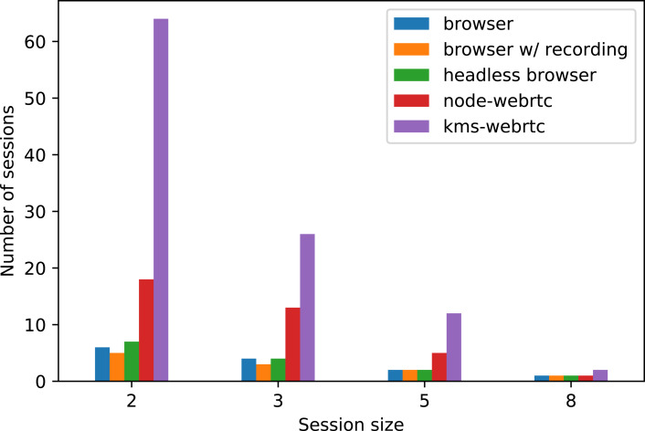{ .round-corners loading=lazy width=706 height=472 }
</div>

---

<div class="grid-90 tablet-grid-90" markdown>
## [Quality-of-Experience driven configuration of WebRTC services through automated testing :fontawesome-solid-external-link:{.external-link-icon}](https://doi.org/10.1109/QRS51102.2020.00031){:target="_blank"}

Antonia Bertolino[ { loading=lazy width=16 height=16 }](https://orcid.org/0000-0001-8749-1356){ target="_blank" aria-label="View ORCID record - 0000-0001-8749-1356" }, Antonello Calabró[ { loading=lazy width=16 height=16 }](https://orcid.org/0000-0001-5502-303X){ target="_blank" aria-label="View ORCID record - 0000-0001-5502-303X" }, Guglielmo De Angelis[ { loading=lazy width=16 height=16 }](https://orcid.org/0000-0002-1076-0076){ target="_blank" aria-label="View ORCID record - 0000-0002-1076-0076" }, Francisco Gortázar[ { loading=lazy width=16 height=16 }](https://orcid.org/0000-0002-2183-0869){ target="_blank" aria-label="View ORCID record - 0000-0002-2183-0869" }, Francesca Lonetti[ { loading=lazy width=16 height=16 }](https://orcid.org/0000-0002-4864-2219){ target="_blank" aria-label="View ORCID record - 0000-0002-4864-2219" }, Michel Maes[ { loading=lazy width=16 height=16 }](https://orcid.org/0000-0002-8138-9702){ target="_blank" aria-label="View ORCID record - 0000-0002-8138-9702" }, Guiomar Tuñón

**Conference**{ .pub-badge .pub-conference } **IEEE 20th International Conference on Software Quality, Reliability and Security (QRS)** · 2020 · [DOI: 10.1109/QRS51102.2020.00031 :fontawesome-solid-external-link:{.external-link-icon}](https://doi.org/10.1109/QRS51102.2020.00031){:target="_blank"}

??? quote "Cite this publication (BibTeX)"

    ```bibtex
    @inproceedings{Bertolino2020,
      author    = {Bertolino, Antonia and Calabró, Antonello and De Angelis, Guglielmo and Gortázar, Francisco and Lonetti, Francesca and Maes, Michel and Tuñón, Guiomar},
      title     = {Quality-of-Experience driven configuration of WebRTC services through automated testing},
      booktitle = {2020 IEEE 20th International Conference on Software Quality, Reliability and Security (QRS)},
      pages     = {152--159},
      year      = {2020},
      doi       = {10.1109/QRS51102.2020.00031}
    }
    ```

Quality of Experience (QoE) refers to the end users level of satisfaction with a real-time service, in particular in relation to its audio and video quality. Advances in WebRTC technology have favored the spread of multimedia services through use of any browser. Provision of adequate QoE in such services is of paramount importance. The assessment of QoE is costly and can be done only late in the service lifecycle. In this work we propose a simple approach for QoE-driven non-functional testing of WebRTC services that relies on the ElasTest open-source platform for end-to-end testing of large complex systems. We describe the ElasTest platform, the proposed approach and an experimental study. In this study, we compared qualitatively and quantitatively the effort required in the ElasTest supported scenario with respect to a "traditional" solution, showing great savings in terms of effort and time.

</div>

---

<div class="grid-90 tablet-grid-90" markdown>
## [A Survey of the Selenium Ecosystem :fontawesome-solid-external-link:{.external-link-icon}](https://doi.org/10.3390/electronics9071067){:target="_blank"}

Boni García[ { loading=lazy width=16 height=16 }](https://orcid.org/0000-0003-1808-8410){ target="_blank" aria-label="View ORCID record - 0000-0003-1808-8410" }, Micael Gallego[ { loading=lazy width=16 height=16 }](https://orcid.org/0000-0002-2875-7342){ target="_blank" aria-label="View ORCID record - 0000-0002-2875-7342" }, Francisco Gortázar[ { loading=lazy width=16 height=16 }](https://orcid.org/0000-0002-2183-0869){ target="_blank" aria-label="View ORCID record - 0000-0002-2183-0869" }, Mario Munoz-Organero[ { loading=lazy width=16 height=16 }](https://orcid.org/0000-0003-4199-2002){ target="_blank" aria-label="View ORCID record - 0000-0003-4199-2002" }

**Journal**{ .pub-badge .pub-journal } **Electronics** (MDPI) · 2020 · [DOI: 10.3390/electronics9071067 :fontawesome-solid-external-link:{.external-link-icon}](https://doi.org/10.3390/electronics9071067){:target="_blank"}

??? quote "Cite this publication (BibTeX)"

    ```bibtex
    @article{Garcia2020Selenium,
      author  = {García, Boni and Gallego, Micael and Gortázar, Francisco and Munoz-Organero, Mario},
      title   = {A Survey of the Selenium Ecosystem},
      journal = {Electronics},
      volume  = {9},
      number  = {7},
      pages   = {1067},
      year    = {2020},
      doi     = {10.3390/electronics9071067}
    }
    ```

Selenium is often considered the de-facto standard framework for end-to-end web testing nowadays. It allows practitioners to drive web browsers (such as Chrome, Firefox, Edge, or Opera) in an automated fashion using different language bindings (such as Java, Python, or JavaScript, among others). The term ecosystem, referring to the open-source software domain, includes various components, tools, and other interrelated elements sharing the same technological background. This article presents a descriptive survey aimed to understand how the community uses Selenium and its ecosystem. This survey is structured in seven categories: Selenium foundations, test development, system under test, test infrastructure, other frameworks, community, and personal experience. In light of the current state of Selenium, we analyze future challenges and opportunities around it.

</div>

<div class="grid-40 tablet-grid-40" markdown="span">
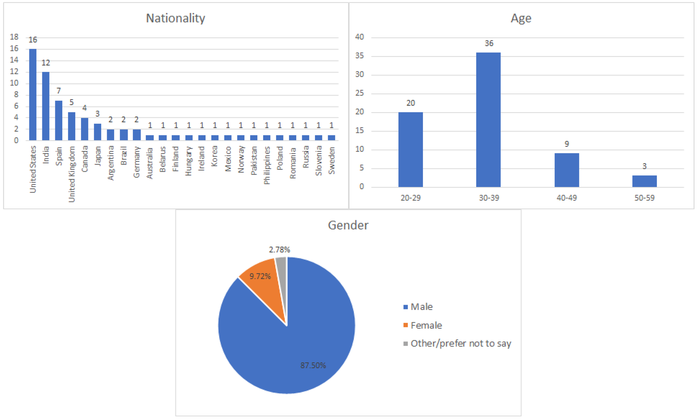{ .round-corners loading=lazy width=1920 height=1156 }
</div>

---

<div class="grid-90 tablet-grid-90" markdown>
## [Assessment of QoE for Video and Audio in WebRTC Applications Using Full-Reference Models :fontawesome-solid-external-link:{.external-link-icon}](https://doi.org/10.3390/electronics9030462){:target="_blank"}

Boni García[ { loading=lazy width=16 height=16 }](https://orcid.org/0000-0003-1808-8410){ target="_blank" aria-label="View ORCID record - 0000-0003-1808-8410" }, Micael Gallego[ { loading=lazy width=16 height=16 }](https://orcid.org/0000-0002-2875-7342){ target="_blank" aria-label="View ORCID record - 0000-0002-2875-7342" }, Francisco Gortázar[ { loading=lazy width=16 height=16 }](https://orcid.org/0000-0002-2183-0869){ target="_blank" aria-label="View ORCID record - 0000-0002-2183-0869" }, Andrew Hines[ { loading=lazy width=16 height=16 }](https://orcid.org/0000-0001-9636-2556){ target="_blank" aria-label="View ORCID record - 0000-0001-9636-2556" }

**Journal**{ .pub-badge .pub-journal } **Electronics** (MDPI) · 2020 · [DOI: 10.3390/electronics9030462 :fontawesome-solid-external-link:{.external-link-icon}](https://doi.org/10.3390/electronics9030462){:target="_blank"}

??? quote "Cite this publication (BibTeX)"

    ```bibtex
    @article{Garcia2020QoE,
      author  = {García, Boni and Gortázar, Francisco and Gallego, Micael and Hines, Andrew},
      title   = {Assessment of QoE for Video and Audio in WebRTC Applications Using Full-Reference Models},
      journal = {Electronics},
      volume  = {9},
      number  = {3},
      pages   = {462},
      year    = {2020},
      doi     = {10.3390/electronics9030462}
    }
    ```

WebRTC is a set of standard technologies that allows exchanging video and audio in real time on the Web. As with other media-related applications, the user-perceived audiovisual quality can be estimated using Quality of Experience (QoE) measurements. This paper analyses the behavior of different objective Full-Reference (FR) models for video and audio in WebRTC applications. FR models calculate the video and audio quality by comparing some original media reference with the degraded signal. To compute these models, we have created an open-source benchmark in which different types of reference media inputs are sent browser to browser while simulating different kinds of network conditions in terms of packet loss and jitter. Our benchmark provides recording capabilities of the impairment WebRTC streams. Then, we use different existing FR metrics for video (VMAF, VIFp, SSIM, MS-SSIM, PSNR, PSNR-HVS, and PSNR-HVS-M) and audio (PESQ, ViSQOL, and POLQA) recordings together with their references. Moreover, we use the same recordings to carry out a subjective analysis in which real users rate the video and audio quality using a Mean Opinion Score (MOS). Finally, we calculate the correlations between the objective and subjective results to find the objective models that better correspond with the subjective outcome, which is considered the ground truth QoE. We find that some of the studied objective models, such as VMAF, VIFp, and POLQA, show a strong correlation with the subjective results in packet loss scenarios.

</div>

<div class="grid-40 tablet-grid-40" markdown="span">
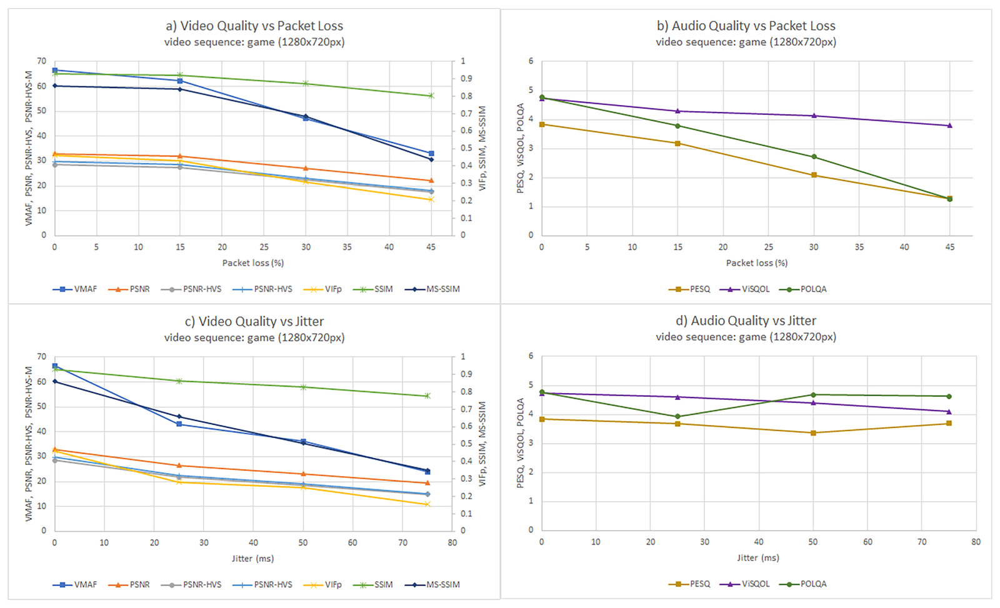{ .round-corners loading=lazy width=1920 height=1168 }
</div>

---

<div class="grid-90 tablet-grid-90" markdown>
## [Understanding and estimating quality of experience in WebRTC applications :fontawesome-solid-external-link:{.external-link-icon}](https://doi.org/10.1007/s00607-018-0669-7){:target="_blank"}

Boni García[ { loading=lazy width=16 height=16 }](https://orcid.org/0000-0003-1808-8410){ target="_blank" aria-label="View ORCID record - 0000-0003-1808-8410" }, Micael Gallego[ { loading=lazy width=16 height=16 }](https://orcid.org/0000-0002-2875-7342){ target="_blank" aria-label="View ORCID record - 0000-0002-2875-7342" }, Francisco Gortázar[ { loading=lazy width=16 height=16 }](https://orcid.org/0000-0002-2183-0869){ target="_blank" aria-label="View ORCID record - 0000-0002-2183-0869" }, Antonia Bertolino[ { loading=lazy width=16 height=16 }](https://orcid.org/0000-0001-8749-1356){ target="_blank" aria-label="View ORCID record - 0000-0001-8749-1356" }

**Journal**{ .pub-badge .pub-journal } **Computing** (Springer) · 2019 · [DOI: 10.1007/s00607-018-0669-7 :fontawesome-solid-external-link:{.external-link-icon}](https://doi.org/10.1007/s00607-018-0669-7){:target="_blank"}

??? quote "Cite this publication (BibTeX)"

    ```bibtex
    @article{Garcia2019Understanding,
      author  = {García, Boni and Gallego, Micael and Gortázar, Francisco and Bertolino, Antonia},
      title   = {Understanding and estimating quality of experience in WebRTC applications},
      journal = {Computing},
      volume  = {101},
      number  = {11},
      pages   = {1585--1607},
      year    = {2019},
      doi     = {10.1007/s00607-018-0669-7}
    }
    ```

WebRTC comprises a set of technologies and standards that provide real-time communication with web browsers, simplifying the embedding of voice and video communication in web applications and mobile devices. The perceived quality of WebRTC communication can be measured using quality of experience (QoE) indicators. QoE is defined as the degree of delight or annoyance of the user with an application or service. This paper is focused on the QoE assessment of WebRTC-based applications and its contribution is threefold. First, an analysis of how WebRTC topologies affect the quality perceived by users is provided. Second, a group of Key Performance Indicators for estimating the QoE of WebRTC users is proposed. Finally, a systematic survey of the literature on QoE assessment in the WebRTC arena is presented.

</div>

<div class="grid-40 tablet-grid-40" markdown="span">
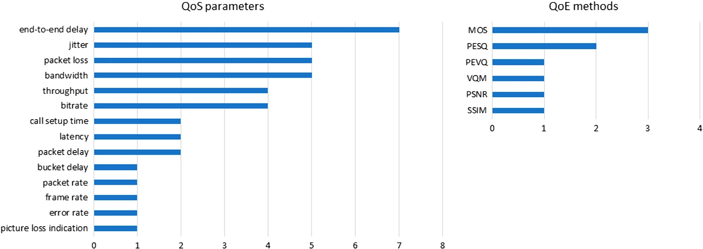{ .round-corners loading=lazy width=1381 height=491 }
</div>

---

<div class="grid-90 tablet-grid-90" markdown>
## [Practical Evaluation of VMAF Perceptual Video Quality for WebRTC Applications :fontawesome-solid-external-link:{.external-link-icon}](https://doi.org/10.3390/electronics8080854){:target="_blank"}

Boni García[ { loading=lazy width=16 height=16 }](https://orcid.org/0000-0003-1808-8410){ target="_blank" aria-label="View ORCID record - 0000-0003-1808-8410" }, Luis López-Fernández, Francisco Gortázar[ { loading=lazy width=16 height=16 }](https://orcid.org/0000-0002-2183-0869){ target="_blank" aria-label="View ORCID record - 0000-0002-2183-0869" }, Micael Gallego[ { loading=lazy width=16 height=16 }](https://orcid.org/0000-0002-2875-7342){ target="_blank" aria-label="View ORCID record - 0000-0002-2875-7342" }

**Journal**{ .pub-badge .pub-journal } **Electronics** (MDPI) · 2019 · [DOI: 10.3390/electronics8080854 :fontawesome-solid-external-link:{.external-link-icon}](https://doi.org/10.3390/electronics8080854){:target="_blank"}

??? quote "Cite this publication (BibTeX)"

    ```bibtex
    @article{Garcia2019VMAF,
      author  = {García, Boni and López-Fernández, Luis and Gortázar, Francisco and Gallego, Micael},
      title   = {Practical Evaluation of VMAF Perceptual Video Quality for WebRTC Applications},
      journal = {Electronics},
      volume  = {8},
      number  = {8},
      pages   = {854},
      year    = {2019},
      doi     = {10.3390/electronics8080854}
    }
    ```

WebRTC is the umbrella term for several emergent technologies aimed to exchange real-time media in the Web. Like other media-related services, the perceived quality of WebRTC communication can be measured using Quality of Experience (QoE) indicators. QoE assessment methods can be classified as subjective (users’ evaluation scores) or objective (models computed as a function of different parameters). In this paper, we focus on VMAF (Video Multi-method Assessment Fusion), which is an emergent full-reference objective video quality assessment model developed by Netflix. VMAF is typically used to assess video streaming services. This paper evaluates the use of VMAF in a different type of application: WebRTC. To that aim, we present a practical use case built on the top of well-known open source technologies, such as JUnit, Selenium, Docker, and FFmpeg. In addition to VMAF, we also calculate other objective QoE video metrics such as Visual Information Fidelity in the pixel domain (VIFp), Structural Similarity (SSIM), or Peak Signal-to-Noise Ratio (PSNR) applied to a WebRTC communication in different network conditions in terms of packet loss. Finally, we compare these objective results with a subjective evaluation using a Mean Opinion Score (MOS) scale to the same WebRTC streams. As a result, we found a strong correlation of the subjective video quality perceived in WebRTC video calls with the objective results computed with VMAF and VIFp in comparison with SSIM and PSNR and their variants.

</div>

<div class="grid-40 tablet-grid-40" markdown="span">
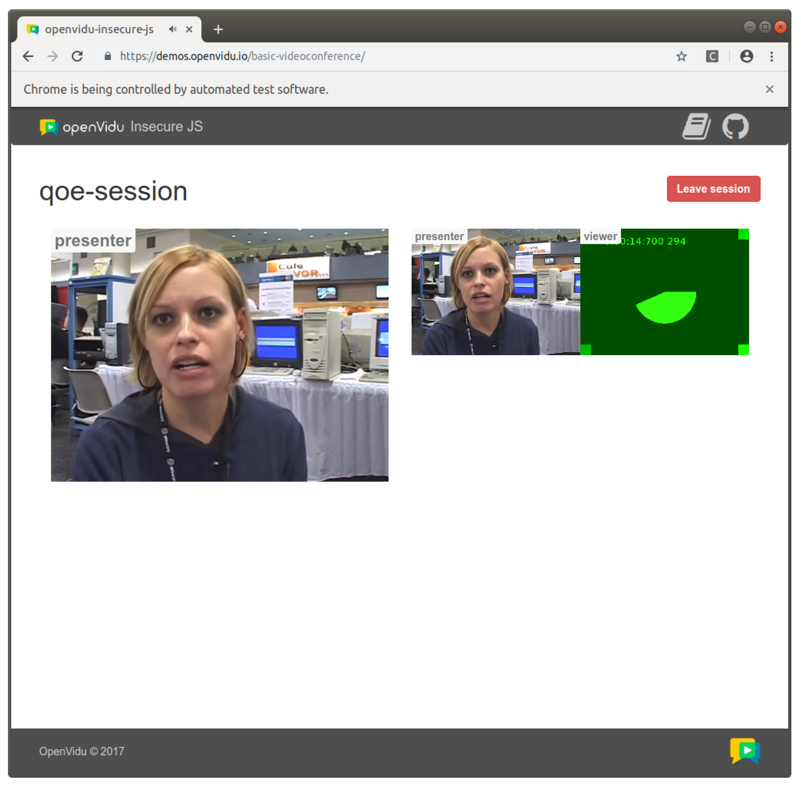{ .control-height .round-corners loading=lazy }
</div>

<div class="grid-40 tablet-grid-40" markdown="span">
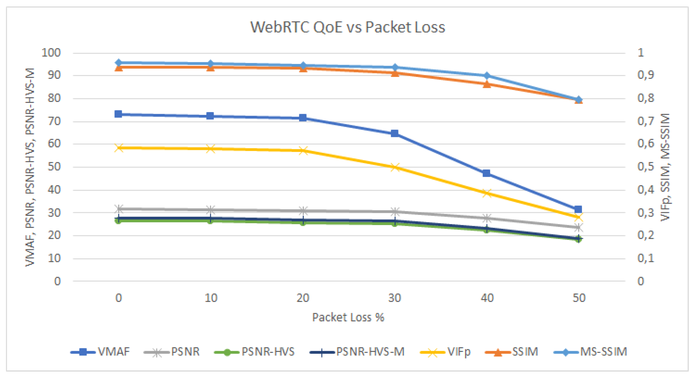{ .round-corners loading=lazy width=2887 height=1577 }
</div>

---

<div class="grid-90 tablet-grid-90" markdown>
## [NUBOMEDIA: The First Open Source WebRTC PaaS :fontawesome-solid-external-link:{.external-link-icon}](https://doi.org/10.1145/3123266.3129392){:target="_blank"}

Boni García[ { loading=lazy width=16 height=16 }](https://orcid.org/0000-0003-1808-8410){ target="_blank" aria-label="View ORCID record - 0000-0003-1808-8410" }, Luis López, Francisco Gortázar[ { loading=lazy width=16 height=16 }](https://orcid.org/0000-0002-2183-0869){ target="_blank" aria-label="View ORCID record - 0000-0002-2183-0869" }, Micael Gallego[ { loading=lazy width=16 height=16 }](https://orcid.org/0000-0002-2875-7342){ target="_blank" aria-label="View ORCID record - 0000-0002-2875-7342" }, Giuseppe Antonio Carella

**Conference**{ .pub-badge .pub-conference } **ACM International Conference on Multimedia (MM '17)** · 2017 · [DOI: 10.1145/3123266.3129392 :fontawesome-solid-external-link:{.external-link-icon}](https://doi.org/10.1145/3123266.3129392){:target="_blank"}

??? quote "Cite this publication (BibTeX)"

    ```bibtex
    @inproceedings{Garcia2017Nubomedia,
      author    = {García, Boni and López, Luis and Gortázar, Francisco and Gallego, Micael and Carella, Giuseppe Antonio},
      title     = {NUBOMEDIA: The First Open Source WebRTC PaaS},
      booktitle = {Proceedings of the 25th ACM International Conference on Multimedia (MM '17)},
      pages     = {1205--1208},
      year      = {2017},
      doi       = {10.1145/3123266.3129392}
    }
    ```

In this paper, we introduce NUBOMEDIA, an open source elastic cloud Platform as a Service (PaaS) specifically designed for real-time interactive multimedia and WebRTC services. NUBOMEDIA exposes its capabilities through simple Application Programming Interfaces (APIs), making possible to deploy and execute developers' applications. To that aim, NUBOMEDIA combines the simplicity and ease of development of API services with the flexibility of PaaS infrastructures. Once an application is implemented, developers just need to deploy it on top of NUBOMEDIA providing elasticity as a service and reliable communication.

</div>

---

<div class="grid-90 tablet-grid-90" markdown>
## [Kurento: The Swiss Army Knife of WebRTC Media Servers :fontawesome-solid-external-link:{.external-link-icon}](https://doi.org/10.1109/MCOMSTD.2017.1700006){:target="_blank"}

Boni García[ { loading=lazy width=16 height=16 }](https://orcid.org/0000-0003-1808-8410){ target="_blank" aria-label="View ORCID record - 0000-0003-1808-8410" }, Luis López, Micael Gallego[ { loading=lazy width=16 height=16 }](https://orcid.org/0000-0002-2875-7342){ target="_blank" aria-label="View ORCID record - 0000-0002-2875-7342" }, Francisco Gortázar[ { loading=lazy width=16 height=16 }](https://orcid.org/0000-0002-2183-0869){ target="_blank" aria-label="View ORCID record - 0000-0002-2183-0869" }

**Journal**{ .pub-badge .pub-journal } **IEEE Communications Standards Magazine** · 2017 · [DOI: 10.1109/MCOMSTD.2017.1700006 :fontawesome-solid-external-link:{.external-link-icon}](https://doi.org/10.1109/MCOMSTD.2017.1700006){:target="_blank"}

??? quote "Cite this publication (BibTeX)"

    ```bibtex
    @article{Garcia2017Swiss,
      author  = {García, Boni and López, Luis and Gallego, Micael and Gortázar, Francisco},
      title   = {Kurento: The Swiss Army Knife of WebRTC Media Servers},
      journal = {IEEE Communications Standards Magazine},
      volume  = {1},
      number  = {2},
      pages   = {44--51},
      year    = {2017},
      doi     = {10.1109/MCOMSTD.2017.1700006}
    }
    ```

In this article we introduce Kurento, an open source WebRTC media server and a set of client APIs intended to simplify the development of applications with rich media capabilities for the Web and smartphone platforms. Kurento features include group communications, transcoding, recording, mixing, broadcasting and routing of audiovisual flows, but also provides advanced media processing capabilities such as computer vision and augmented reality. It is based on a modular architecture, which makes it possible for developers to extend and customize its native capabilities with third-party media processing algorithms. Thanks to all of this, Kurento can be a powerful tool for Web developers who may find natural programming with its Java and JavaScript APIs following the traditional three-tiered Web development model.

</div>

---

<div class="grid-90 tablet-grid-90" markdown>
## [WebRTC Testing: Challenges and Practical Solutions :fontawesome-solid-external-link:{.external-link-icon}](https://doi.org/10.1109/MCOMSTD.2017.1700005){:target="_blank"}

Boni García[ { loading=lazy width=16 height=16 }](https://orcid.org/0000-0003-1808-8410){ target="_blank" aria-label="View ORCID record - 0000-0003-1808-8410" }, Francisco Gortázar[ { loading=lazy width=16 height=16 }](https://orcid.org/0000-0002-2183-0869){ target="_blank" aria-label="View ORCID record - 0000-0002-2183-0869" }, Luis López, Micael Gallego[ { loading=lazy width=16 height=16 }](https://orcid.org/0000-0002-2875-7342){ target="_blank" aria-label="View ORCID record - 0000-0002-2875-7342" }, Miguel Paris

**Journal**{ .pub-badge .pub-journal } **IEEE Communications Standards Magazine** · 2017 · [DOI: 10.1109/MCOMSTD.2017.1700005 :fontawesome-solid-external-link:{.external-link-icon}](https://doi.org/10.1109/MCOMSTD.2017.1700005){:target="_blank"}

??? quote "Cite this publication (BibTeX)"

    ```bibtex
    @article{Garcia2017Challenges,
      author  = {García, Boni and Gortázar, Francisco and López, Luis and Gallego, Micael and París, Miguel},
      title   = {WebRTC Testing: Challenges and Practical Solutions},
      journal = {IEEE Communications Standards Magazine},
      volume  = {1},
      number  = {2},
      pages   = {36--42},
      year    = {2017},
      doi     = {10.1109/MCOMSTD.2017.1700005}
    }
    ```

WebRTC comprises a set of novel technologies and standards that provide Real-Time Communication on Web browsers. WebRTC makes simple the embedding of voice and video communications in all types of applications. However, releasing those applications to production is still very challenging due to the complexity of their testing. Validating a WebRTC service requires assessing many functional (e.g. signaling logic, media connectivity, etc.) and non-functional (e.g. quality of experience, interoperability, scalability, etc.) properties on large, complex, distributed and heterogeneous systems that spawn across client devices, networks and cloud infrastructures. In this article, we present a novel methodology and an associated tool for doing it at scale and in an automated way. Our strategy is based on a blackbox end-to-end approach through which we use an automated containerized cloud environment for instrumenting Web browser clients, which benchmark the SUT (system under test), and fake clients, that load it. Through these benchmarks, we obtain, in a reliable and statistically significant way, both network-dependent QoS (Quality of Service) metrics and media-dependent QoE (Quality of Experience) indicators. These are fed, at a second stage, to a number of testing assertions that validate the appropriateness of the functional and non-functional properties of the SUT under controlled and configurable load and fail conditions. To finish, we illustrate our experiences using such tool and methodology in the context of the Kurento open source software project and conclude that they are suitable for validating large and complex WebRTC systems at scale.

</div>

---

<div class="grid-90 tablet-grid-90" markdown>
## [Designing and evaluating the usability of an API for real-time multimedia services in the Internet :fontawesome-solid-external-link:{.external-link-icon}](https://doi.org/10.1007/s11042-016-3729-z){:target="_blank"}

Luis López-Fernández, Boni García[ { loading=lazy width=16 height=16 }](https://orcid.org/0000-0003-1808-8410){ target="_blank" aria-label="View ORCID record - 0000-0003-1808-8410" }, Micael Gallego[ { loading=lazy width=16 height=16 }](https://orcid.org/0000-0002-2875-7342){ target="_blank" aria-label="View ORCID record - 0000-0002-2875-7342" }, Francisco Gortázar[ { loading=lazy width=16 height=16 }](https://orcid.org/0000-0002-2183-0869){ target="_blank" aria-label="View ORCID record - 0000-0002-2183-0869" }

**Journal**{ .pub-badge .pub-journal } **Multimedia Tools and Applications** (Springer) · 2017 · [DOI: 10.1007/s11042-016-3729-z :fontawesome-solid-external-link:{.external-link-icon}](https://doi.org/10.1007/s11042-016-3729-z){:target="_blank"}

??? quote "Cite this publication (BibTeX)"

    ```bibtex
    @article{LopezFernandez2017Usability,
      author  = {López-Fernández, Luis and García, Boni and Gallego, Micael and Gortázar, Francisco},
      title   = {Designing and evaluating the usability of an API for real-time multimedia services in the Internet},
      journal = {Multimedia Tools and Applications},
      volume  = {76},
      number  = {12},
      pages   = {14247--14304},
      year    = {2017},
      doi     = {10.1007/s11042-016-3729-z}
    }
    ```

In the last few years, multimedia technologies in general, and Real-Time multimedia Communications (RTC) in particular, are becoming mainstream among WWW and smartphone developers, who have an increasing interest in richer media capabilities for creating their applications. The engineering literature proposing novel algorithms, protocols and architectures for managing and processing multimedia information is currently overwhelming. However, most of these results do not arrive to applications due to the lack of simple and usable APIs. Interestingly, in this context in which APIs are the critical ingredient for reaching wide developer audiences, the scientific literature about multimedia APIs and their usability is scarce. In this paper we try to contribute to fill this gap by proposing the RTC Media API: a novel type of API designed with the aim of making simple for developers the use of latest trends in RTC multimedia including WebRTC, Video Content Analysis or Augmented Reality. We provide a specification of such API and discuss how it satisfies a set of design requirements including programming-language agnosticism, adaptation to cloud environments, support to multisensory multimedia, etc. After that, we describe an implementation of such an API that has been created in the context of the Kurento open source software project, and present a study evaluating the API usability performed in a group of more than 40 professional developers distributed worldwide. In the light of the obtained results, we conclude that the usability of the API is adequate across the main development activities (i.e. API learning, code creation and code maintenance), with an average usability score of 3.39 over 5 in a Likert scale, and that this result is robust with respect to developers’ profiles, cultures, professional experiences and preferred programming languages.

</div>

<div class="grid-40 tablet-grid-40" markdown="span">
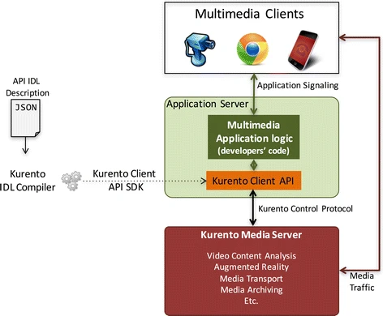{ .round-corners loading=lazy width=472 height=390 }
</div>

<div class="grid-40 tablet-grid-40" markdown="span">
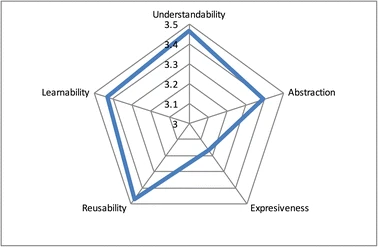{ .round-corners loading=lazy width=378 height=247 }
</div>

---

<div class="grid-90 tablet-grid-90" markdown>
## [WebRTC Testing: State of the Art :fontawesome-solid-external-link:{.external-link-icon}](https://doi.org/10.5220/0006442003630371){:target="_blank"}

Boni García[ { loading=lazy width=16 height=16 }](https://orcid.org/0000-0003-1808-8410){ target="_blank" aria-label="View ORCID record - 0000-0003-1808-8410" }, Micael Gallego[ { loading=lazy width=16 height=16 }](https://orcid.org/0000-0002-2875-7342){ target="_blank" aria-label="View ORCID record - 0000-0002-2875-7342" }, Francisco Gortázar[ { loading=lazy width=16 height=16 }](https://orcid.org/0000-0002-2183-0869){ target="_blank" aria-label="View ORCID record - 0000-0002-2183-0869" }, Eduardo Jiménez

**Conference**{ .pub-badge .pub-conference } **12th International Conference on Software Technologies (ICSOFT)** · 2017 · [DOI: 10.5220/0006442003630371 :fontawesome-solid-external-link:{.external-link-icon}](https://doi.org/10.5220/0006442003630371){:target="_blank"}

??? quote "Cite this publication (BibTeX)"

    ```bibtex
    @inproceedings{Garcia2017StateArt,
      author    = {García, Boni and Gallego, Micael and Gortázar, Francisco and Jiménez, Eduardo},
      title     = {WebRTC Testing: State of the Art},
      booktitle = {Proceedings of the 12th International Conference on Software Technologies (ICSOFT)},
      pages     = {363--371},
      year      = {2017},
      doi       = {10.5220/0006442003630371}
    }
    ```

WebRTC is the umbrella term for a number of emerging technologies that extends the web browsing model to exchange real-time media (Voice over IP, VoIP) with other browsers. The mechanisms to provide quality assurance for WebRTC are key to release this kind of applications to production environments. Nevertheless, testing WebRTC based application, consistently automated fashion is a challenging problem. The aim of this piece of research is to provide a comprehensive summary of the current trends in the domain of WebRTC testing. For the sake of completeness, we have carried out this survey by aggregating the results from three different sources of information: i) Scientific and academia research papers; ii) WebRTC testing tools (both commercial and open source); iii) "Grey literature”, that is, materials produced by organizations outside of the traditional commercial or academic publishing and distribution channels.

</div>

---

<div class="grid-90 tablet-grid-90" markdown>
## [Analysis of Video Quality and End-to-End Latency in WebRTC :fontawesome-solid-external-link:{.external-link-icon}](https://doi.org/10.1109/GLOCOMW.2016.7848838){:target="_blank"}

Boni García[ { loading=lazy width=16 height=16 }](https://orcid.org/0000-0003-1808-8410){ target="_blank" aria-label="View ORCID record - 0000-0003-1808-8410" }, Luis López-Fernández, Francisco Gortázar[ { loading=lazy width=16 height=16 }](https://orcid.org/0000-0002-2183-0869){ target="_blank" aria-label="View ORCID record - 0000-0002-2183-0869" }, Micael Gallego[ { loading=lazy width=16 height=16 }](https://orcid.org/0000-0002-2875-7342){ target="_blank" aria-label="View ORCID record - 0000-0002-2875-7342" }

**Conference**{ .pub-badge .pub-conference } **IEEE Globecom Workshops (GC Wkshps)** · 2016 · [DOI: 10.1109/GLOCOMW.2016.7848838 :fontawesome-solid-external-link:{.external-link-icon}](https://doi.org/10.1109/GLOCOMW.2016.7848838){:target="_blank"}

??? quote "Cite this publication (BibTeX)"

    ```bibtex
    @inproceedings{Garcia2016Latency,
      author    = {García, Boni and López-Fernández, Luis and Gortázar, Francisco and Gallego, Micael},
      title     = {Analysis of Video Quality and End-to-End Latency in WebRTC},
      booktitle = {2016 IEEE Globecom Workshops (GC Wkshps)},
      pages     = {1--6},
      year      = {2016},
      doi       = {10.1109/GLOCOMW.2016.7848838}
    }
    ```

WebRTC is a set of emerging technologies that extends the web browsing model to exchange real-time media with other browsers. Despite the fact that WebRTC is still in under development, it is gaining the attention of practitioners quickly. For that reason, the mechanisms to provide quality assurance for WebRTC are key to release these kind of applications to production environments. Nevertheless, testing WebRTC based application, consistently automated fashion is a challenging problem. This article presents the Kurento Testing Framework (KTF), a piece of software aimed to simplify the evaluation activities for WebRTC applications and services. It provides advanced features to carry out complete assessment of WebRTC applications in terms of functionality and quality- of-experience.

</div>

---

<div class="grid-90 tablet-grid-90" markdown>
## [Kurento: The WebRTC Modular Media Server :fontawesome-solid-external-link:{.external-link-icon}](https://doi.org/10.1145/2964284.2973798){:target="_blank"}

Luis López, Miguel París, Santiago Carot, Boni García[ { loading=lazy width=16 height=16 }](https://orcid.org/0000-0003-1808-8410){ target="_blank" aria-label="View ORCID record - 0000-0003-1808-8410" }, Micael Gallego[ { loading=lazy width=16 height=16 }](https://orcid.org/0000-0002-2875-7342){ target="_blank" aria-label="View ORCID record - 0000-0002-2875-7342" }, Francisco Gortázar[ { loading=lazy width=16 height=16 }](https://orcid.org/0000-0002-2183-0869){ target="_blank" aria-label="View ORCID record - 0000-0002-2183-0869" }, Raul Benítez, Jose A. Santos, David Fernández, Radu Tom Vlad, Iván Gracia, Francisco Javier López

**Conference**{ .pub-badge .pub-conference } **ACM International Conference on Multimedia (MM '16)** · 2016 · [DOI: 10.1145/2964284.2973798 :fontawesome-solid-external-link:{.external-link-icon}](https://doi.org/10.1145/2964284.2973798){:target="_blank"}

??? quote "Cite this publication (BibTeX)"

    ```bibtex
    @inproceedings{Lopez2016Modular,
      author    = {López, Luis and París, Miguel and Carot, Santiago and García, Boni and Gallego, Micael and Gortázar, Francisco and Benítez, Raul and Santos, Jose A. and Fernández, David and Vlad, Radu Tom and Gracia, Iván and López, Francisco Javier},
      title     = {Kurento: The WebRTC Modular Media Server},
      booktitle = {Proceedings of the 24th ACM International Conference on Multimedia (MM '16)},
      pages     = {1187--1191},
      year      = {2016},
      doi       = {10.1145/2964284.2973798}
    }
    ```

In this paper we introduce Kurento Media Server: an open source WebRTC Media Server providing a toolbox of capabilities which include group communications, recording, routing, transcoding and mixing. Kurento supports a large number of media protocols such as WebRTC, plain RTP, RTSP or HTTP and bunch of codecs including VP8, VP9, H.264, H.263, OPUS, Speex, PCM or AMR. Kurento Media Server is based on a modular architecture, which makes it possible for developers to extend and customize its native capabilities with advanced media processing features such as computer vision, augmented reality or speech analysis. Kurento is ideal for WWW developers who find natural programming with its Java and JavaScript APIs following the traditional three tiered WWW development model.

</div>

---

<div class="grid-90 tablet-grid-90" markdown>
## [Testing Framework for WebRTC Services :fontawesome-solid-external-link:{.external-link-icon}](https://dl.acm.org/doi/10.5555/3021385.3021393){:target="_blank"}

Boni García[ { loading=lazy width=16 height=16 }](https://orcid.org/0000-0003-1808-8410){ target="_blank" aria-label="View ORCID record - 0000-0003-1808-8410" }, Luis López-Fernández, Micael Gallego[ { loading=lazy width=16 height=16 }](https://orcid.org/0000-0002-2875-7342){ target="_blank" aria-label="View ORCID record - 0000-0002-2875-7342" }, Francisco Gortázar[ { loading=lazy width=16 height=16 }](https://orcid.org/0000-0002-2183-0869){ target="_blank" aria-label="View ORCID record - 0000-0002-2183-0869" }

**Conference**{ .pub-badge .pub-conference } **9th EAI International Conference on Mobile Multimedia Communications (MobiMedia)** · 2016 · [ACM Digital Library ↗ :fontawesome-solid-external-link:{.external-link-icon}](https://dl.acm.org/doi/10.5555/3021385.3021393){:target="_blank"}

??? quote "Cite this publication (BibTeX)"

    ```bibtex
    @inproceedings{Garcia2016TestingFramework,
      author    = {García, Boni and López-Fernández, Luis and Gallego, Micael and Gortázar, Francisco},
      title     = {Testing Framework for WebRTC Services},
      booktitle = {Proceedings of the 9th EAI International Conference on Mobile Multimedia Communications (MobiMedia)},
      year      = {2016},
      publisher = {ICST},
      url       = {https://dl.acm.org/doi/10.5555/3021385.3021393}
    }
    ```

WebRTC is the umbrella term for several emergent technologies aimed to exchange real-time media in the Web. WebRTC is gaining the attention of practitioners quickly, and therefore the mechanisms to provide quality assurance for WebRTC services are becoming more and more demanded. WebRTC has been conceived as a peer-to-peer architecture where browsers can directly communicate. This model can be extended using a media server to provide extra features such as group communications, media recording, and so on. In this context, the open source initiative kurento.org provides a WebRTC media server and a set of APIs aimed to simplify the development of advanced WebRTC applications. Among these APIs, Kurento provides a high level testing infrastructure to assess WebRTC services in terms of functionality, performance, and quality-of-experience. This paper presents a detailed description of the testing services provided by this framework.

</div>

---

<div class="grid-90 tablet-grid-90" markdown>
## [NUBOMEDIA: An Elastic PaaS Enabling the Convergence of Real-Time and Big Data Multimedia :fontawesome-solid-external-link:{.external-link-icon}](https://doi.org/10.1109/SmartCloud.2016.11){:target="_blank"}

Boni García[ { loading=lazy width=16 height=16 }](https://orcid.org/0000-0003-1808-8410){ target="_blank" aria-label="View ORCID record - 0000-0003-1808-8410" }, Micael Gallego[ { loading=lazy width=16 height=16 }](https://orcid.org/0000-0002-2875-7342){ target="_blank" aria-label="View ORCID record - 0000-0002-2875-7342" }, Luis López, Giuseppe Antonio Carella, Alice Cheambe

**Conference**{ .pub-badge .pub-conference } **IEEE International Conference on Smart Cloud (SmartCloud)** · 2016 · [DOI: 10.1109/SmartCloud.2016.11 :fontawesome-solid-external-link:{.external-link-icon}](https://doi.org/10.1109/SmartCloud.2016.11){:target="_blank"}

??? quote "Cite this publication (BibTeX)"

    ```bibtex
    @inproceedings{Garcia2016Elastic,
      author    = {García, Boni and Gallego, Micael and López, Luis and Carella, Giuseppe Antonio and Cheambe, Alice},
      title     = {NUBOMEDIA: An Elastic PaaS Enabling the Convergence of Real-Time and Big Data Multimedia},
      booktitle = {2016 IEEE International Conference on Smart Cloud (SmartCloud)},
      pages     = {45--56},
      year      = {2016},
      doi       = {10.1109/SmartCloud.2016.11}
    }
    ```

The increasing acceptance of Network Function Virtualization (NFV) and Software Defined Networks (SDN) paradigms is enabling the creation of cloud technologies combining Real-Time multimedia Communications (RTC) and multimedia processing for big data. Although many vendors already provide solutions in these areas, none of them comprises a single platform for end-to-end service provisioning and deployment addressing all the complexities of combining RTC and media processing. As a result, developing such types of applications is still extremely complex. Following this, we present NUBOMEDIA, an open-source platform enabling developers to create and deploy RTC applications with advanced media processing capabilities. For this, NUBOMEDIA introduces the concept of Media Pipeline: chains of interconnected media processing elements. At deployment time, NUBOMEDIA follows a Platform as a Service (PaaS) scheme, which abstracts for developers most of the complex infrastructure-related tasks such as: provisioning, scaling or QoS and network management. In this paper we present the NUBOMEDIA architecture, which bases on ETSI NFV recommendations, and introduce the main interfaces and capabilities it exposes to developers. To conclude, we present some early experiments demonstrating, through benchmarks, the suitability of the platform to combine RTC and advanced media processing algorithms maintaining the stringent QoS requirements of RTC.

</div>

---

<div class="grid-90 tablet-grid-90" markdown>
## [Design and Implementation of a High Performant PaaS Platform for Creating Novel Real-Time Communication Paradigms :fontawesome-solid-external-link:{.external-link-icon}](https://dl.ifip.org/db/conf/icin/icin2016/1570230514.pdf){:target="_blank"}

Alice Cheambe, Flavio Murgia, Pasquale Maiorano Picone, Boni García[ { loading=lazy width=16 height=16 }](https://orcid.org/0000-0003-1808-8410){ target="_blank" aria-label="View ORCID record - 0000-0003-1808-8410" }, Micael Gallego[ { loading=lazy width=16 height=16 }](https://orcid.org/0000-0002-2875-7342){ target="_blank" aria-label="View ORCID record - 0000-0002-2875-7342" }, Giuseppe Antonio Carella, Lorenzo Tomasini, Alin Calinciuc, Cristian Spoiala

**Conference**{ .pub-badge .pub-conference } **19th IEEE Conference on Innovations in Clouds, Internet and Networks (ICIN)** · 2016 · [Full text :fontawesome-regular-file-pdf: :fontawesome-solid-external-link:{.external-link-icon}](https://dl.ifip.org/db/conf/icin/icin2016/1570230514.pdf){:target="_blank"}

??? quote "Cite this publication (BibTeX)"

    ```bibtex
    @inproceedings{Cheambe2016,
      author    = {Cheambe, Alice and Murgia, Flavio and Picone, Pasquale Maiorano and García, Boni and Gallego, Micael and Carella, Giuseppe Antonio and Tomasini, Lorenzo and Calinciuc, Alin and Spoiala, Cristian},
      title     = {Design and Implementation of a High Performant PaaS Platform for Creating Novel Real-Time Communication Paradigms},
      booktitle = {19th International Conference on Innovations in Clouds, Internet and Networks (ICIN)},
      year      = {2016},
      url       = {https://dl.ifip.org/db/conf/icin/icin2016/1570230514.pdf}
    }
    ```

This paper presents the design and implementation of a Real Time Communication and multimedia processing architecture that uses emerging Network Function Virtualization (NFV) and Software Defined Networks (SDN) to provide enabling cloud technologies. This is work done within the EU project NUBOMEDIA. The main objective of the NUBOMEDIA project is to address the complexity usually involved in providing such a platform, thereby providing a single platform for end-to-end service provisioning, deployment and availability of services. To validate the platform, within the project use case implementations from eHealth, IPTV, augmented reality and collaborative e-Learning are being developed and tested. For such services, a Platform-as-a-Service (PaaS) strategy is proposed which hides the complexity of the infrastructure thereby abstracting services for provisioning, scaling, QoS and network management. This paper highlights the NUBOMEDIA architecture and describe the application deployment procedure for developers.

</div>

---

<div class="grid-90 tablet-grid-90" markdown>
## [Authentication, Authorization, and Accounting in WebRTC PaaS Infrastructures: The Case of Kurento :fontawesome-solid-external-link:{.external-link-icon}](https://doi.org/10.1109/MIC.2014.102){:target="_blank"}

Luis López-Fernández, Micael Gallego[ { loading=lazy width=16 height=16 }](https://orcid.org/0000-0002-2875-7342){ target="_blank" aria-label="View ORCID record - 0000-0002-2875-7342" }, Boni García[ { loading=lazy width=16 height=16 }](https://orcid.org/0000-0003-1808-8410){ target="_blank" aria-label="View ORCID record - 0000-0003-1808-8410" }, David Fernández-López, Francisco Javier López

**Journal**{ .pub-badge .pub-journal } **IEEE Internet Computing** · 2014 · [DOI: 10.1109/MIC.2014.102 :fontawesome-solid-external-link:{.external-link-icon}](https://doi.org/10.1109/MIC.2014.102){:target="_blank"}

??? quote "Cite this publication (BibTeX)"

    ```bibtex
    @article{LopezFernandez2014,
      author  = {López-Fernández, Luis and Gallego, Micael and García, Boni and Fernández-López, David and López, Francisco Javier},
      title   = {Authentication, Authorization, and Accounting in WebRTC PaaS Infrastructures: The Case of Kurento},
      journal = {IEEE Internet Computing},
      volume  = {18},
      number  = {6},
      pages   = {34--40},
      year    = {2014},
      doi     = {10.1109/MIC.2014.102}
    }
    ```

WebRTC server infrastructures are useful for creating rich real-time communication (RTC) applications. Developers commonly use them for accessing capabilities such as group communications, archiving, and transcoding. Details on how to implement and use such infrastructures securely are of increasing interest to the engineering community. Kurento is an open source project that provides a WebRTC media server and a platform as a service cloud built on top of it. The authors present the Kurento API and analyze different security models for it, investigating the suitability of using simple access control lists (ACLs) and capability-based security schemes to provide authorization. Using minimal implementation, they discuss the advantages and drawbacks of each scheme and conclude that, for the proposed schemes, ACLs are less scalable but provide more granularity.

</div>

</div>
